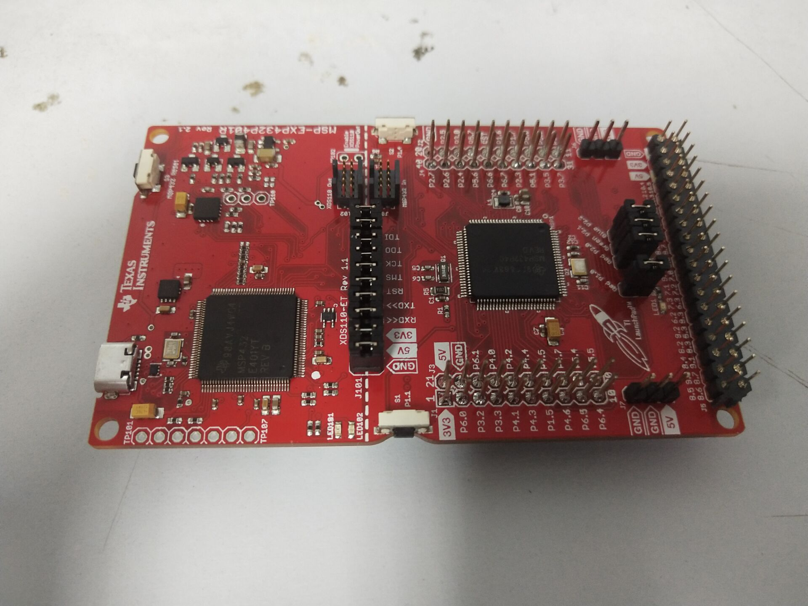
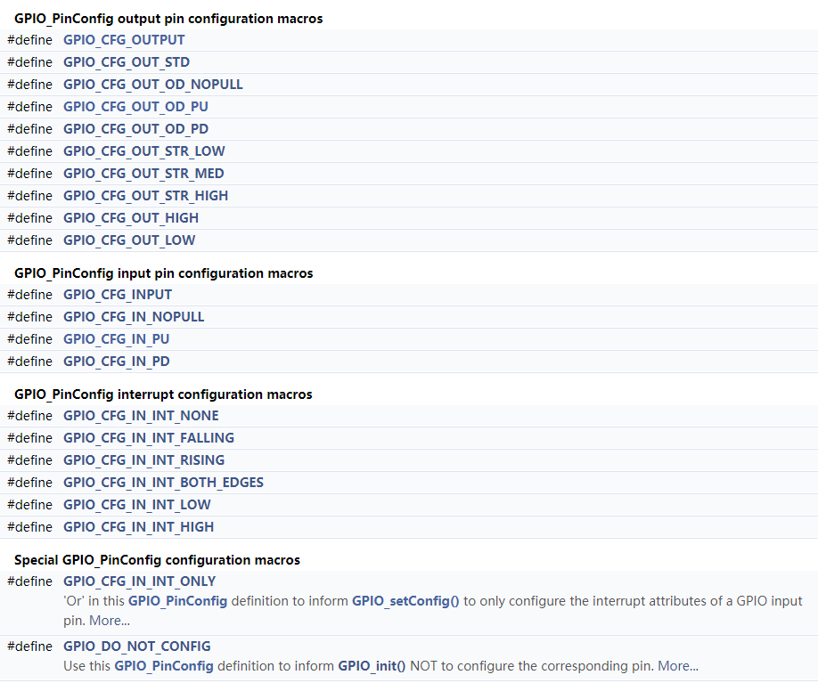

# GPIO的使用

[TOC]

## 介绍

经过了前面两章的学习，其实你已经拥有了一定自学这些功能的能力了，故在本章及之后的章节，我的讲解可能会逐渐变得简洁。

GPIO的知识其实很简单，准确说应该是所有章节中最简单的，如果你学习过数电，那么应该对逻辑电平有所了解，GPIO可以说就是一个用来控制芯片引脚输出不同逻辑电平的外设。当然，我在这里不会太多讲这些基础知识，我的重点仍然是完成编程即可。

## 重点

GPIO常用的两种功能：输入、输出。其中输入，功能其实就是通过引脚去检测外部的电平，而输出则是改变自身引脚的电平。如果加上了时钟，我们就可以完成一些特殊的操作，例如如果我们把高电平理解为逻辑1，低电平理解为逻辑0，那么我们把一段时间进行均匀划分，并在每个划分区间内进行一次电平检测，即可得到一串有先后的1和0，从而完成了数据的传输。这也是之前我们串口的做法。而我们如果把电平的高低变化，以一定频率一定比例进行组合，即可完成对能量的控制，实现如调光、调声、调速等功能，这些则是完成了控制。因此我们知道了GPIO可以实现的功能主要为两个方向：一是通信，二是控制。事实上其它外设的功能基本也无非是做这两件事情，只不过它们把一些处理以硬件电路的方式进行搭建了，因而使用那些外设我们就可以得到更加简单于高效的使用效果。但是哪怕没有那些外设，只要我们知道这些通信或控制的物理原理，我们基本上都可以通过GPIO来完成这些效果。

## 硬件

事实上我们能看到MSP432P401R这块芯片的所有引脚本质上应该都有GPIO的功能，不过硬件已经设计好了，主要使用那些通过排针引出来的引脚就好了。TI这款红色的板子并没有完整地焊接所有的引出引脚，可以看到在最下面有两排洞，它们也是可以被焊接的引脚，你可以根据需要使用排针或者排母进行焊接，就像我这样：



关于电路焊接技巧的相关知识我不在此介绍，如果感兴趣可以在网上搜索，焊接不是简单的把锡糊在焊点上，多学习一些技巧对焊接效率以及焊点性能都会有很大提升。

## BSP

在上一章我们已经讲解了BSP的相关概念，在这里我们再重新关注一下我们这个开发板的板载资源，因为本章之后我们即会完成本开发板的完整BSP封装（并不是说学会了GPIO就可以完成完整BSP，只是因为这一个板子上拥有的资源仅需要GPIO和串口即可完成封装）

### 分析

#### 仿真器-单片机

如果我们要分析一下这个板子，第一步其实就是可以把这个板子划分为两个部分：仿真器部分和单片机部分。这两个部分的连接内容主要有四个：电源、复位、串口、仿真。

电源很好理解，即GND、5V、3.3V三个脚。

复位引脚是RST，这个引脚拉低了之后可以让芯片重新启动。

串口我们上一章讲过了，即RXD和TXD。

剩余的引脚就是仿真引脚了，通过它们的命名可以知道是JTAG引脚。

以上的功能中，在编程里我们需要设置的仅有串口（事实上还需要配置JTAG引脚的，不过那个好像不是在程序里配置的，所以不用管）。而电源和复位是硬件电路关注的东西，不用在编程中关注它们。

#### 按键

可以看到整个板子连接了三个按键，上面一个，左右各一个。其中上面那个是复位的按键，可以不用管，而左右的两个按键则是我们可以控制的了，等会我们会对其进行配置。

#### LED

LED也就是发光二极管，在这个板子上有两颗，其中一颗是红色单色LED，另一个是RGB三色LED，可以关注板子上中下方的那四个跳线帽，这四个LED通过跳线帽与单片机相连。等会我们也会对其进行配置。

## GPIO的参数

GPIO常用的参数有：

-   输入或输出
-   输出电平
-   上拉或下拉电阻
-   推挽输出或开漏输出

其中前两个从字面意思可以理解，第三个上拉或下拉电阻用于稳定电平，因为比如在如果某个引脚设为输入时，它在没有与任何物体进行连接的时候，它的电平是未知且不稳定的，我们此时应该为它添加上拉电阻或下拉电阻让它的电平稳定。主要功能差不多是如此，如果想要了解更多请自行百度。

而第四个推挽和开漏的区别在于两者对于外部电路的驱动力，具体原理有点复杂，建议百度一下。一般而言我们都是使用推挽输出，开漏输出主要用于需要较大电流的控制或者一些特殊线路（如I2C），另外需要注意，如果使用开漏输出则必须接外部上拉才能得到高电平（如果不接上拉而进行高电平输出的话，线路呈高阻态）。

## 例程

关于按键和LED的例程，我们应该可以找到两个，其中一个是gpiointerrupt，另一个是buttonled，在这一章里面我们暂时只讲gpiointerrupt，因为buttonled它用了一个TI-Drivers的更加高级的封装，这个我们在最后提一下。

关于TI RTOS的部分，都是一样的，而关于那块的分析我们暂时先不讲。

```c
/*
 *  ======== gpiointerrupt.c ========
 */
#include <stdint.h>
#include <stddef.h>

/* Driver Header files */
#include <ti/drivers/GPIO.h>

/* Driver configuration */
#include "ti_drivers_config.h"

/*
 *  ======== gpioButtonFxn0 ========
 *  Callback function for the GPIO interrupt on CONFIG_GPIO_BUTTON_0.
 */
void gpioButtonFxn0(uint_least8_t index)
{
    /* Clear the GPIO interrupt and toggle an LED */
    GPIO_toggle(CONFIG_GPIO_LED_0);
}

/*
 *  ======== gpioButtonFxn1 ========
 *  Callback function for the GPIO interrupt on CONFIG_GPIO_BUTTON_1.
 *  This may not be used for all boards.
 */
void gpioButtonFxn1(uint_least8_t index)
{
    /* Clear the GPIO interrupt and toggle an LED */
    GPIO_toggle(CONFIG_GPIO_LED_1);
}

/*
 *  ======== mainThread ========
 */
void *mainThread(void *arg0)
{
    /* Call driver init functions */
    GPIO_init();

    /* Configure the LED and button pins */
    GPIO_setConfig(CONFIG_GPIO_LED_0, GPIO_CFG_OUT_STD | GPIO_CFG_OUT_LOW);
    GPIO_setConfig(CONFIG_GPIO_LED_1, GPIO_CFG_OUT_STD | GPIO_CFG_OUT_LOW);
    GPIO_setConfig(CONFIG_GPIO_BUTTON_0, GPIO_CFG_IN_PU | GPIO_CFG_IN_INT_FALLING);

    /* Turn on user LED */
    GPIO_write(CONFIG_GPIO_LED_0, CONFIG_GPIO_LED_ON);

    /* install Button callback */
    GPIO_setCallback(CONFIG_GPIO_BUTTON_0, gpioButtonFxn0);

    /* Enable interrupts */
    GPIO_enableInt(CONFIG_GPIO_BUTTON_0);

    /*
     *  If more than one input pin is available for your device, interrupts
     *  will be enabled on CONFIG_GPIO_BUTTON1.
     */
    if (CONFIG_GPIO_BUTTON_0 != CONFIG_GPIO_BUTTON_1) {
        /* Configure BUTTON1 pin */
        GPIO_setConfig(CONFIG_GPIO_BUTTON_1, GPIO_CFG_IN_PU | GPIO_CFG_IN_INT_FALLING);

        /* Install Button callback */
        GPIO_setCallback(CONFIG_GPIO_BUTTON_1, gpioButtonFxn1);
        GPIO_enableInt(CONFIG_GPIO_BUTTON_1);
    }

    return (NULL);
}
```

### GPIO_init

以上代码我们直接从mainThread开始看，首先是GPIO_init()，根据我们UART的经验，这个就是系统初始化，每次都要用，但是不用管它的具体内容。

### GPIO_setConfig

这个函数的功能从名字上就不难知道是设置GPIO的模式，相对于UART，它的地位类似于UART_Params_init和UART_Open的结合（其实只是Open部分，因为GPIO的配置不需要像UART那样一堆参数，所以它的参数是直接手动写的）。

而对于这个函数的参数，第一个是index，这个在ti_drivers_config中，之前我们说过这种写法了，第二个参数就是它的配置参数了。

关于这个参数，可以参考GPIO.h的东西，当然直接看手册比较方便，实际上它就是一堆宏定义，可以通过按位与组合起来用于寄存器的配置。



不要担心看着很长，他们的命名是有规律的。开头统一是GPIO，然后是CFG，如果是输出，就是OUTPUT（只有一个）或OUT，输入则是INPUT（只有一个）或IN，再往后如果是输出，则是推挽（STD，其实这里是标准的意思，不过它的标准就是推挽），和开漏（OD），接着是开漏输出分为无上下拉NOPULL、上拉PU和下拉PD，推挽根据驱动能力STR分为高HIGH、中MED、低LOW。至于输出最后两个则是代表了输出高电平或输出低电平。

而输入分为普通输入和中断输入INT，其中普通输入可以选择上拉或下拉或无拉，中断则分为无中断NONE、下降沿中断FALLING、上升沿RISING、两端BOTH_EDGES、低电平LOW、高电平HIGH。

除此之外还有特殊的配置，仅配置中断IN_INT_ONLY，和不要配置DO_NOT_CONFIG，不过我没想懂这两个有啥用，鉴于精力有限就不去深究了，感兴趣可以去自己看看源代码。

### GPIO_write

配置输出电平，第一个是index，第二个是1或0，它用的宏定义，1是高电平，0是低电平。

### GPIO_setCallback

设置回调函数，本质上和UART的uartCallback那个参数一样，就是用一个回调函数的指针，不过UART直接在打开Open的时候去配置，而这个是用专门的函数配置。

### GPIO_enableInt

使能中断，只有在中断使能后才可以触发，就像UART需要用read使能一样，但是GPIO不用在中断中重新使能。

### GPIO_toggle

这个是在中断回调中使用的函数，功能是翻转电平，高变低，低变高。

## 小节

事实上GPIO还有更多的功能，包括清除中断标志、关闭中断等等，这里不详述了，有了前面的功能我们已经够用了。如果感兴趣其它功能可以查看头文件或手册。

## 封装BSP

以下是封装内容，根据目前已经掌握的知识完全可以看懂。

bsp_init.c

```c
/*************************************************************************************
 * @Description  : 
 * @Version      : 
 * @Author       : YunWuHai
 * @Date         : 2021-07-12 14:57:29
 * @LastEditors  : YunWuHai
 * @LastEditTime : 2021-07-12 16:48:47
 * @FilePath     : \BSP\bsp_init.c
 * @Copyright (C) 2021 YunWuHai. All rights reserved.
 *************************************************************************************/
#include "bsp_init.h"


void __attribute__((weak)) leftButtonPush(uint_least8_t index)
{
    UART_write(PC_UART_Handle, "左键按下\r\n", sizeof("左键按下\r\n"));
}

void __attribute__((weak)) rightButtonPush(uint_least8_t index)
{
    UART_write(PC_UART_Handle, "右键按下\r\n", sizeof("右键按下\r\n"));
}

void __attribute__((weak)) UART0_Read_ISR(UART_Handle handle, void* buf, size_t size)
{
    UART_write(handle, buf, size);
    UART_read(handle, buf, size);
}

uint8_t BSP_GPIO_Init(uint8_t maskOnLED)
{
    GPIO_init();

    /* 初始化LED */
    GPIO_setConfig(SINGLE_RED_LED, GPIO_CFG_OUT_STD | GPIO_CFG_OUT_LOW);
    GPIO_setConfig(RGB_RED_LED, GPIO_CFG_OUT_STD | GPIO_CFG_OUT_LOW);
    GPIO_setConfig(RGB_GREEN_LED, GPIO_CFG_OUT_STD | GPIO_CFG_OUT_LOW);
    GPIO_setConfig(RGB_BLUE_LED, GPIO_CFG_OUT_STD | GPIO_CFG_OUT_LOW);

    /* 当且仅当串口打开后可以开启按键中断，同时如果没有开启串口，灯光也不会直接亮起 */
    if(PC_UART_Handle != NULL)  
    {
        GPIO_setCallback(LEFT_BUTTON, &leftButtonPush);
        GPIO_setCallback(RIGHT_BUTTON, &rightButtonPush);
        GPIO_enableInt(LEFT_BUTTON);
        GPIO_enableInt(RIGHT_BUTTON);
        if(maskOnLED & SINGLE_RED)GPIO_write(SINGLE_RED_LED, CONFIG_GPIO_LED_ON);
        if(maskOnLED & RGB_RED)GPIO_write(RGB_RED_LED, CONFIG_GPIO_LED_ON);
        if(maskOnLED & RGB_GREEN)GPIO_write(RGB_GREEN_LED, CONFIG_GPIO_LED_ON);
        if(maskOnLED & RGB_BLUE)GPIO_write(RGB_BLUE_LED,CONFIG_GPIO_LED_ON);
        return BSP_ALL_OK;
    }
    else
    {
        return BSP_BUTTON_ISR_ERROR;
    }
}

void BSP_UART_Init(void)
{
    UART_Params uartParams;
    
    UART_init();

    UART_Params_init(&uartParams);
    uartParams.writeDataMode = UART_DATA_BINARY;
    uartParams.readDataMode = UART_DATA_BINARY;
    uartParams.readMode = UART_MODE_CALLBACK;
    uartParams.readCallback = &UART0_Read_ISR;
    uartParams.readReturnMode = UART_RETURN_FULL;
    uartParams.readEcho = UART_ECHO_OFF;

    PC_UART_Handle = UART_open(UART0, &uartParams);
}

```

bsp_init.h

```c
/*************************************************************************************
 * @Description  : 用于MSP432的板级的初始化
 * @Version      : 
 * @Author       : YunWuHai
 * @Date         : 2021-07-12 14:58:17
 * @LastEditors  : YunWuHai
 * @LastEditTime : 2021-07-12 16:48:54
 * @FilePath     : \BSP\bsp_init.h
 * @Copyright (C) 2021 YunWuHai. All rights reserved.
 *************************************************************************************/
#ifndef _BSP_INIT_H_
#define _BSP_INIT_H_

#include <ti/drivers/GPIO.h>
#include <ti/drivers/UART.h>
#include "ti_drivers_config.h"

#define BSP_ALL_OK              0
#define BSP_BUTTON_ISR_ERROR    1

#define SINGLE_RED  0x01
#define RGB_RED     0x02
#define RGB_GREEN   0x04
#define RGB_BLUE    0x08

UART_Handle huart0; // UART0的句柄
#define PC_UART_Handle huart0

uint8_t BSP_GPIO_Init(uint8_t maskOnLED);
void BSP_UART_Init(void);

#endif
```

在每次初始化的时候先调用BSP_UART_Init即可完成和仿真器相连的那个UART的配置，接着调用BSP_GPIO_Init即可完成GPIO的配置，其参数为启动阶段要亮的灯，同时如果UART开启失败，这个灯也不会亮。

除此之外可以重定义三个中断回调弱函数leftButtonPush、rightButtonPush和UART0_Read_ISR。如果不重定义，则默认为回响程序。

## 高级封装

实际上我们上面的写法并不是特别优秀的写法，尤其是针对按键的部分，我们没有设计消抖之类的程序，这样导致最直接的结果就是我们在按键的时候可能因为硬件抖动而导致检测到多次按键。这个问题可以使用消抖电路来用硬件解决，那种方式比较简单但是对成本要求更高。而且针对已经做出来的开发板，让它重新修改电路显然不是一个很好的主意。但是如果自己来封装又感觉太麻烦，除了要写按键中断外还需要为其设计消抖程序，用到计时器等功能，于是TI便自己设计了一个库函数，把基础的按键检测功能综合了一下，制作了在TI-Driver中的Button库，这个库你可以在我们之前的driver文件夹中的app文件夹中找到。除此之外它还封装了一个LED库，可以比较简单地使用LED进行闪烁、变色等功能，现在我们来看看它的示例程序buttonled。

和前面一样，我们不看申请RTOS的部分，直接看buttonled.c。

```c
/*
 *    ======== buttonled.c ========
 */
#include <stdint.h>
#include <stdbool.h>
#include <unistd.h>

/* Driver Header files */
#include <ti/drivers/GPIO.h>
#include <ti/display/Display.h>
#include <ti/drivers/utils/RingBuf.h>
#include <ti/drivers/apps/LED.h>
#include <ti/drivers/apps/Button.h>

/* Driver Configuration */
#include "ti_drivers_config.h"

#define BLINKCOUNT            3
#define FASTBLINK             500
#define SLOWBLINK             1000
#define FIFTYMS               50000
#define EVENTBUFSIZE          10


#ifndef CONFIG_BUTTONCOUNT
#define CONFIG_BUTTONCOUNT     2
#endif

#ifndef CONFIG_LEDCOUNT
#define CONFIG_LEDCOUNT        2
#else
#define CONFIG_LED2            2
#endif

typedef struct buttonStats
{
    unsigned int pressed;
    unsigned int clicked;
    unsigned int released;
    unsigned int longPress;
    unsigned int longClicked;
    unsigned int doubleclicked;
    unsigned int lastpressedduration;
} buttonStats;

Button_Handle    buttonHandle[CONFIG_BUTTONCOUNT];
LED_Handle       ledHandle[CONFIG_LEDCOUNT];
Display_Handle   display;
buttonStats      bStats;
RingBuf_Object   ringObj;
uint8_t          eventBuf[EVENTBUFSIZE];


/*
 *  ======== doEventLogs ========
 */
void doEventLogs(void)
{
    uint8_t event;
    while(RingBuf_get(&ringObj, &event) >= 0)
    {
        if(event & Button_EV_CLICKED)
        {
            Display_print0(display, 0, 0, "Button:Click");
        }
        if(event & Button_EV_DOUBLECLICKED)
        {
            Display_print0(display, 0, 0, "Button:Double Click");
        }
        if(event & Button_EV_LONGPRESSED)
        {
            Display_print0(display, 0, 0, "Button:Long Pressed");
        }
    }
}

/*
 *  ======== handleButtonCallback ========
 */
void handleButtonCallback(Button_Handle handle, Button_EventMask events)
{
    uint_least8_t ledIndex = (buttonHandle[CONFIG_BUTTON_0] == handle) ?
                              CONFIG_LED_0 : CONFIG_LED_1;
    LED_Handle led = ledHandle[ledIndex];

    if(Button_EV_PRESSED == (events & Button_EV_PRESSED))
    {
        bStats.pressed++;
    }

    if(Button_EV_RELEASED == (events & Button_EV_RELEASED))
    {
        bStats.released++;
    }

    if(Button_EV_CLICKED == (events & Button_EV_CLICKED))
    {
        bStats.clicked++;
        bStats.lastpressedduration =
                Button_getLastPressedDuration(handle);

        /* Put event in ring buffer for printing */
        RingBuf_put(&ringObj, events);

        if(LED_STATE_BLINKING == LED_getState(led))
        {
            LED_stopBlinking(led);
            LED_setOff(led);
        }
        else
        {
            LED_toggle(led);
        }
    }

    if(Button_EV_LONGPRESSED == (events & Button_EV_LONGPRESSED))
    {
        bStats.longPress++;

        /* Put event in ring buffer for printing */
        RingBuf_put(&ringObj, events);

        LED_startBlinking(led, SLOWBLINK, LED_BLINK_FOREVER);
    }

    if(Button_EV_LONGCLICKED == (events & Button_EV_LONGCLICKED))
    {
        bStats.longClicked++;
        bStats.lastpressedduration = Button_getLastPressedDuration(handle);
        LED_stopBlinking(led);
    }

    if(Button_EV_DOUBLECLICKED == (events & Button_EV_DOUBLECLICKED))
    {
        bStats.doubleclicked++;

        /* Put event in ring buffer for printing */
        RingBuf_put(&ringObj, events);

        if(LED_STATE_BLINKING != LED_getState(led))
        {
            LED_startBlinking(led, FASTBLINK, BLINKCOUNT);
        }
        else
        {
            LED_stopBlinking(led);
            LED_setOff(led);
        }
    }
}

/*
 *  ======== mainThread ========
 */
void *mainThread(void *arg0)
{
    int inc;
    bool dir = true;

    Button_Params  buttonParams;
    LED_Params     ledParams;

    GPIO_init();
    Button_init();
    LED_init();

    /* Create ring buffer to store button events */
    RingBuf_construct(&ringObj, eventBuf, EVENTBUFSIZE);

    /* Open the UART display for output */
    display = Display_open(Display_Type_UART, NULL);
    if(display == NULL)
    {
        while(1);
    }

    Display_print0(display, 0, 0, "Button/LED Demo:\n"
                   "Each button controls an LED. Click to toggle, "
                   "double click to fast blink three times, "
                   "hold the button to slow blink.\n");

    /* Open button 1 and button 2 */
    Button_Params_init(&buttonParams);
    buttonHandle[CONFIG_BUTTON_0] = Button_open(CONFIG_BUTTON_0,
                                              handleButtonCallback,
                                              &buttonParams);
    buttonHandle[CONFIG_BUTTON_1] = Button_open(CONFIG_BUTTON_1,
                                              handleButtonCallback,
                                              &buttonParams);

    /* Check if the button open is successful */
    if((buttonHandle[CONFIG_BUTTON_1]  == NULL) ||
        (buttonHandle[CONFIG_BUTTON_0]  == NULL))
    {
        Display_print0(display, 0, 0, "Button Open Failed!");
    }

    /* Open LED0 and LED1 with default params */
    LED_Params_init(&ledParams);
    ledHandle[CONFIG_LED_0] = LED_open(CONFIG_LED_0, &ledParams);
    ledHandle[CONFIG_LED_1] = LED_open(CONFIG_LED_1, &ledParams);
    if((ledHandle[CONFIG_LED_0] == NULL) || (ledHandle[CONFIG_LED_1] == NULL))
    {
        Display_print0(display, 0, 0, "LED Open Failed!");
    }

#if CONFIG_LEDCOUNT > 2
    /* Open a PWM LED if our board has one */
    ledParams.setState = LED_STATE_ON;
    ledHandle[CONFIG_LED_2] = LED_open(CONFIG_LED_2, &ledParams);
    if(ledHandle[CONFIG_LED_2] == NULL)
    {
        Display_print0(display, 0, 0, "PWM LED Open Failed!");
    }
#endif


    while(1)
    {

        /* Does a "heart beat" effect for the PWM LED if we opened one */
        for(inc = 0; inc < 100; inc += 5)
        {
#if CONFIG_LEDCOUNT > 2
            int duty;
            if(dir)
            {
                duty = inc;
            }
            else
            {
                duty = 100 - inc;
            }
            LED_setOn(ledHandle[CONFIG_LED_2], duty);
#endif

            /* Print out button events */
            doEventLogs();
            usleep(FIFTYMS);
        }
        dir = !dir;
    }
}
```

### init

我们从主程序看过去，首先是三个init，作用我们基本已经很熟了，配置环境实现代码间移植。

### RingBuf_construct

这个是初始化环形缓冲区的函数，环形缓冲区是一个数据结构，如果学过数据结构课的应该知道这个的功能，这里它不是主要的，不细讲，不懂的请自行百度，简单点意思就是它创建了一个首位相接的数组，其中eventBuf是指向这个环形缓冲区数据部分的指针，而reingObj则是一个句柄结构体。

### Display_open

这个Display是用于数据显示功能的，这里它的显示方式是Display_Type_UART，也就是串口打印。它类似于我们之前对UART的printf封装，但是又更加丰富，因为除了通过串口，它还可以通过LCD屏幕等方式进行输出显示，只需要选择好对应的封装配置就行。关于Display的功能我还没完全弄懂，且不为本节重点，故之后再说。

后面跟了一个检测是否出错，未来这种检测语句我不再提示。

### Display_print

打印功能，注意这里的参数虽然很多行而且引号是分开打的，但是对于C语言来说，这种中间没有其它逗号分号连接的字符串，本质上是连接在一起的，也就是说这几行会被当作一行字符串来处理。它的功能就是输出打印。它是根据Display_doPrintf的封装而来，其中第二个和第三个参数是显示0行0列。

### Button_Params_init

参数初始化，设置默认参数，点进去查看注释，主要是修改了消抖时间10ms、长按检测时间2000ms、按钮事件掩码0xFF。可以根据实际需求进行修改，不过一般这个数值是比较理想的。

### Button_open

开启按键，主要是开启了按键的事件，注意里面的除了index和最后的params，中间那个就是回调函数，可以点进去发现是在我们当前文件的前面。

### LED_Params_init

LED参数配置，默认LED以关闭形式初始化，闪烁周期为0，最大亮度（仅适用于PWM LED）和PWM周期（仅适用于PWM LED）。关于不知道PWM的我在前面提到过，想了解更多的可以自行百度。

### LED_open

开启LED，这个没有回调了

### Display_print0

带有0个参数的打印，同理是Display_doPrintf的封装。

### 后续配置

后面是配置了另一个LED灯，这个灯初始化状态为开启，该函数仅在有超过两个LED灯的板子上运行，对于我们这个板子，很显然是符合的。这些配置在ti_drivers_config中。

### while(1)

当上述配置完成后，就开始运行主程序了（事实上中断在前面就开始了，但是因为运行速度比较快，故当我们感知到的时候他已经完成了配置）

在主循环中执行的是一个简易的PWM呼吸灯程序。在其中执行了一个doEventLogs，这种带Logs的程序一看就是日志程序，事实也是如此，我们点进去查看会发现他从环形缓存中不断地读取状态值，这个状态值也是在Button.h中有宏定义的。

但是这个状态值从哪来的呢？我们知道环形缓存本质上只是一个缓存空间，那么它的数据来自哪？从日志内容其实我们也可以知道，肯定来自于回调函数了。

### 回调函数

回调函数中开头先进行了一个三元运算，去判断此次按键是哪个被按下了，那么它就控制哪一个led的句柄。

然后就是通过events参数去判断具体的按键状态，事实上如果把这些状态宏定义点进去你也会发现这些其实是一堆8421的数据，也就是说通过与运算可以获取每位信息。

-   **Button_getLastPressDuration**

    这个函数会获取上一次按下的持续时间，用于判断上次按下的持续时间，不过没看懂他在这放个这个有啥用。

然后再回到程序中，我们发现在click这，程序把event装载到了环形缓存中。然后判断了一下LED是不是在Blink闪烁状态，如果是则停止闪烁，换成关闭。如果不是闪烁则直接翻转。

接下来是判断长按，如果处于长按则开始闪烁。

然后是判断一个叫LONGCLICK的状态，通过点进去查看注释我大概了解到它的功能应该是点击一下然后长按。这个状态就是停止闪烁。

接下来是双击判断，这个状态会开启闪烁，闪烁速度为快，闪烁次数为3。

## 测试

GPIO的相关知识大概就是如此了，现在你依靠这些知识可以实现很多功能了，那么不如来尝试一下把我前面所说的BSP封装以Button和LED的库进行更加高级的封装吧，注意这里的回调不同按键其实是可以使用不同的函数哦，不一定非要像他那种用一个函数弄出来。
