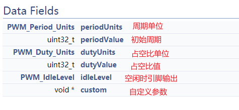

# PWM的使用

## 介绍

PWM，中文名脉冲宽度调制，主要应用于测量、通信、控制等各种应用中，它是一种非常有用的技术，关于具体介绍可以查看百度百科：

https://baike.baidu.com/item/%E8%84%89%E5%86%B2%E5%AE%BD%E5%BA%A6%E8%B0%83%E5%88%B6

## 例子

打开pwmled2这个例子，看到pwmled2.c。

```c
/*
 *  ======== pwmled2.c ========
 */
/* For usleep() */
#include <unistd.h>
#include <stddef.h>

/* Driver Header files */
#include <ti/drivers/PWM.h>

/* Driver configuration */
#include "ti_drivers_config.h"

/*
 *  ======== mainThread ========
 *  Task periodically increments the PWM duty for the on board LED.
 */
void *mainThread(void *arg0)
{
    /* Period and duty in microseconds */
    uint16_t   pwmPeriod = 3000;
    uint16_t   duty = 0;
    uint16_t   dutyInc = 100;

    /* Sleep time in microseconds */
    uint32_t   time = 50000;
    PWM_Handle pwm1 = NULL;
    PWM_Handle pwm2 = NULL;
    PWM_Params params;

    /* Call driver init functions. */
    PWM_init();

    PWM_Params_init(&params);
    params.dutyUnits = PWM_DUTY_US;
    params.dutyValue = 0;
    params.periodUnits = PWM_PERIOD_US;
    params.periodValue = pwmPeriod;
    pwm1 = PWM_open(CONFIG_PWM_0, &params);
    if (pwm1 == NULL) {
        /* CONFIG_PWM_0 did not open */
        while (1);
    }

    PWM_start(pwm1);

    pwm2 = PWM_open(CONFIG_PWM_1, &params);
    if (pwm2 == NULL) {
        /* CONFIG_PWM_0 did not open */
        while (1);
    }

    PWM_start(pwm2);

    /* Loop forever incrementing the PWM duty */
    while (1) {
        PWM_setDuty(pwm1, duty);

        PWM_setDuty(pwm2, duty);

        duty = (duty + dutyInc);

        if (duty == pwmPeriod || (!duty)) {
            dutyInc = - dutyInc;
        }

        usleep(time);
    }
}
```

直接观察上面的内容可以知道PWM的使用方法：

1.  `PWM_init()`

2.  `PWM_Params_init(PWM_Params* params)`

3.  细调params，参数如下：

    

4.  `PWM_Handle handle = PWM_Open(index, &params)`配置

5.  `PWM_start(handle)`开启

6.  `PWM_setDuty`设置占空比

一般来说我们配置PWM主要关注点在于其周期和占空比，设置方式如下：

### 占空比

使用PWM_setDuty设置占空比，设置方法需要考虑params的dutyUnits。这个设置有三种：

-   PWM_DUTY_US：微秒，通过周期和占空比的比值计算占空比

-   PWM_DUTY_FRACTION：占空比小数，这个好像比较常用，计算方法：

    ```c
    dutyCycle = (uint32_t)(((uint64_t)PWM_DUTY_FRACTION_MAX * duty) / 100);
    PWM_setDuty(pwm, dutyCycle);
    ```

    这里dutyCycle是一个临时变量，它的目的是计算PWM_DUTY_FRACTION模式下setDuty的参数，而这里的duty是占空比的百分值，例如duty = 50，则占空比=50%

-   PWM_DUTY_COUNTS

    这个是用计数器来算的，和周期同理，不过比值是来自于计数器的设置。如果使用过STM32的PWM对此应该比较熟悉。

### 周期

和占空比同理，有三个方法：

1.  PWM_PERIOD_US：微秒周期
2.  PWM_PERIOD_HZ：赫兹周期
3.  PWM_PERIOD_COUNTS：计数器周期

周期这个比较好理解，就不多说了，设置函数为PWM_setPeriod，也可以用PWM_setDutyAndPeriod同时设置占空比和周期。

### 空闲状态

前面说的空闲状态输出，对此有两个宏定义：

-   PWM_IDLE_LOW
-   PWM_IDLE_HIGH

如其名，不多解释了。

## 测试

通过PWM而非LED库控制一个全彩呼吸灯（通过控制三色LED不同颜色输出的亮度（通过占空比调整）可以实现不同色彩的输出）。
