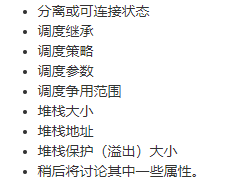
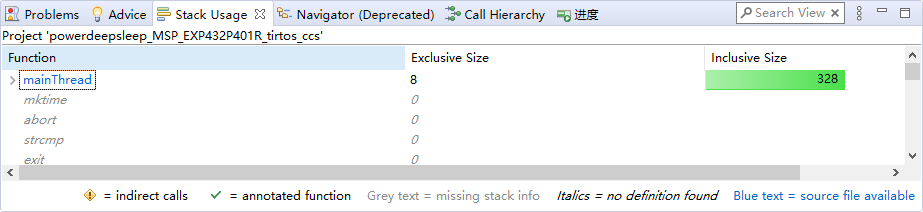
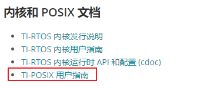

# RTOS的使用

## 介绍

关于RTOS实时操作系统的优点等介绍我就不多说了，网上可以搜到，这里我们使用TI-RTOS，是TI公司自己弄的一个实时操作系统。TI此外还是用POSIX对它进行了封装，POSIX本身不是一种RTOS，而是一种封装，和CMSIS RTOS差不多。另外在CCS上面（至少我的这个CCS上面）使用FreeRTOS好像有点问题。建议还是使用TI RTOS吧，其实也比FreeRTOS功能要丰富点。

此部分参考劳伦斯利弗莫尔国家实验室发布的POSIX编程教程，网址如下：

https://hpc-tutorials.llnl.gov/posix/

## 使用

### Pthread

Pthread是POSIX标准中对API封装的一种规范，可以通过这个规范把其它RTOS的内容移植到Pthread中。

### 功能分类

Pthread API的程序可以如下分类：

线程管理：创建、删除、连接等等

互斥锁：类似Semaphore的东西，不过有所不同，感兴趣可以参考这个[博客](http://www.blogjava.net/fhtdy2004/archive/2009/07/05/285519.html)

条件变量：线程间通信

同步：读写屏障（SPI例程里面那种）

### 注意命名

Pthread的命名是有规律的，通过观察命名可以便于理解和记忆，当然，不理解其实没有任何关系。（如果这一段看不懂，可以在浏览器里翻译）

|   Routine Prefix   |                 Functional Group                 |
| :----------------: | :----------------------------------------------: |
|      pthread_      | Threads themselves and miscellaneous subroutines |
|   pthread_attr_    |            Thread attributes objects             |
|   pthread_mutex_   |                     Mutexes                      |
| pthread_mutexattr_ |            Mutex attributes objects.             |
|   pthread_cond_    |               Condition variables                |
| pthread_condattr_  |           Condition attributes objects           |
|    pthread_key_    |            Thread-specific data keys             |
|  pthread_rwlock_   |                 Read/write locks                 |
|  pthread_barrier_  |             Synchronization barriers             |

不过说实话，没必要记，用多了自然会，常年用不到你记了也没用。

### 电脑上运行

电脑上也可以运行pthread的程序，不过一般需要在Linux中配置。其实很多实时操作系统都可以在电脑中运行，这样可以便于在没有硬件的情况下进行模拟。不过，一般我们不用这种方式，我们是硬件工程师，怎么能没有硬件。

### 创建线程

main程序为默认的线程，而如果需要运行其它线程则需要显示创建（当然也可以用一些工具来辅助，比如说CubeIDE就有FreeRTOS的辅助工具，不过为了TI RTOS好像没有）。

使用pthread_create来创建，其中各参数的介绍如下：

>   `pthread_create` arguments:
>
>   -   **thread**: An opaque, unique identifier for the new thread returned by the subroutine.
>   -   **attr**: An opaque attribute object that may be used to set thread attributes. You can specify a thread attributes object, or NULL for the default values.
>   -   **start_routine**: the C routine that the thread will execute once it is created.
>   -   **arg**: A single argument that may be passed to start_routine. It must be passed by reference as a pointer cast of type void. NULL may be used if no argument is to be passed.

第一个参数类型是`pthread_t`，第二个是`pthread_attr_t`，第三个是一个函数指针，第四个是void指针（任意数值都可以传）。

注意线程是平等关系，即在线程中创建的线程，它们是平等的关系，没有依赖或层次结构（当然它们还是存在优先级关系的）。

其中第一个参数类似于句柄一样的存在，第三个参数是线程真正运行的功能，第四个是传给线程的参数，可见其它关于线程的所有设置都是在第二个参数中实现的。事实上它拥有如下的功能，这些是我在前面说的那个教程里面看到的：



我们可以使用`pthread_attr_init()`函数来初始化设置它们为默认值，这也是之前每个例程中都会出现的。

然后我们使用一些设置函数来具体的设置一些功能，这些功能TI列了一个表，我把它使用浏览器翻译然后复制过来了，其中关于函数是否应在主线程或线程中运行的部分删除了，因为我认为这个对于我们轻度使用没必要记，如果有需要到时候自己查表就行，重要的点我则进行了标记，其中被删除线标记的是在未来计划删除不建议使用或已不能用的函数：

| **pthread_attr**                 | **线程属性**                | 重要 |
| -------------------------------- | --------------------------- | ---- |
| pthread_attr_destroy             | 销毁线程属性对象            |      |
| pthread_attr_getdetachstate      | 在属性对象中获取分离状态    |      |
| pthread_attr_getguardsize        | 获取属性对象中的保护大小    |      |
| ~~pthread_attr_getinheritsched~~ | 不支持 - 内核调度策略已修复 |      |
| pthread_attr_getschedparam       | 获取属性对象中的调度参数    |      |
| ~~pthread_attr_getschedpolicy~~  | 不支持 - 内核调度策略已修复 |      |
| ~~pthread_attr_getscope~~        | 不支持 - 内核没有进程的概念 |      |
| pthread_attr_getstack            | 获取堆栈大小和地址属性      |      |
| pthread_attr_getstacksize        | 获取属性对象中的堆栈大小    |      |
| pthread_attr_init                | 初始化线程属性对象          | ✓    |
| pthread_attr_setdetachstate      | 在属性对象中设置分离状态    | ✓    |
| pthread_attr_setguardsize        | 在属性对象中设置保护大小    |      |
| ~~pthread_attr_setinheritsched~~ | 不支持 - 内核调度策略已修复 |      |
| pthread_attr_setschedparam       | 在属性对象中设置调度参数    | ✓    |
| ~~pthread_attr_setschedpolicy~~  | 不支持 - 内核调度策略已修复 |      |
| ~~pthread_attr_setscope~~        | 不支持 - 内核没有进程的概念 |      |
| pthread_attr_setstack            | 设置堆栈大小和地址          |      |
| pthread_attr_setstacksize        | 设置堆栈大小                | ✓    |

其中init首先调用，然后是后面的设置。pthread_attr_setschedparam调度参数本质上就是优先级，而pthread_attr_setstacksize设置堆栈大小一般是128的倍数（但是现代MCU的Flash很大了，如果你的线程不多，在某些线程需求堆栈比较多的情况下，直接以1024的倍数来翻倍就行，而如果你的内存紧缺，那还是好好分配一下，可以依靠编译器编译生成的堆栈调度来查看细调）



而对于分离操作来说一般是有必要的，如果不分离，且函数在运行结束前没有join，那么这个函数的内存将不会被释放，而且会占用很多资源，编程僵尸线程，而如果我们讲其分离了就不会有这种危险。这个操作可以在创建线程时实现（就像我们在这里设置参数），或是在线程内部进行设置。

总体上参考例程里面创建mainThread的部分即可完成此部分。

实现为：

```c
// 在这个例子中我不进行完成成功判断，以使程序比较好看
#define THREADSTACKSIZE    1024

pthread_t           thread;	// 线程句柄
pthread_attr_t      attrs;	// 参数
struct sched_param  priParam;	// 优先级

priParams.sched_priority = 1;

pthread_attr_init(&attrs);
pthread_attr_setschedparam(&attrs, &priParam);
pthread_attr_setdetachstate(&attrs, PTHREAD_CREATE_DETACHED);
pthread_attr_setstacksize(&attrs, THREADSTACKSIZE);

pthread_create(&thread, &attrs, mainThread, NULL);
```

实现上述功能即可创建一个新的线程。

### 删除线程

终止一个线程可以释放它的资源（分离或合并join状态）。

可以以如下方式终止：

-   正常返回
-   pthread_exit：主动关闭，强制
-   pthread_cancel：另一个线程取消一个线程
-   exec（linux）或exit：整个程序被终止
-   main首先完成，而不pthread_exit显示调用自身

一般来说我们简单使用，在分离任务中调用exit即可。如需了解更多请自行学习，这些内容有点复杂。

### 例程

那个教程给了个例程，但是是Linux下的，同时注意这个例程的功能很简单，只能作为参考使用：

```c
#include <pthread.h>
#include <stdio.h>
#define NUM_THREADS     5

void *PrintHello(void *threadid)
{
   long tid;
   tid = (long)threadid;
   printf("Hello World! It's me, thread #%ld!\n", tid);
   pthread_exit(NULL);
}

int main (int argc, char *argv[])
{
   pthread_t threads[NUM_THREADS];
   int rc;
   long t;
   for(t=0; t<NUM_THREADS; t++){
      printf("In main: creating thread %ld\n", t);
      rc = pthread_create(&threads[t], NULL, PrintHello, (void *)t);
      if (rc){
         printf("ERROR; return code from pthread_create() is %d\n", rc);
         exit(-1);
      }
   }
   /* Last thing that main() should do */
   pthread_exit(NULL);
}
```

输出结果为，注意上述程序实现了线程创建的参数，这个是我们的TI RTOS例程中没有出现过的：

```c
In main: creating thread 0
In main: creating thread 1
Hello World! It's me, thread #0!
In main: creating thread 2
Hello World! It's me, thread #1!
Hello World! It's me, thread #2!
In main: creating thread 3
In main: creating thread 4
Hello World! It's me, thread #3!
Hello World! It's me, thread #4!
```

有了上述功能后你基本上可以完成一点基础的工作了，参考SPI那一章的barrier还可以实现线程同步。如果你使用遇到了问题或者希望学习更多功能，请主要参考TI的文档：



鉴于时间关系，就不写更多了，因为POSIX在Linux中用的挺多的，所以基本上有什么问题都可以找到Linux中的例子或解释。
