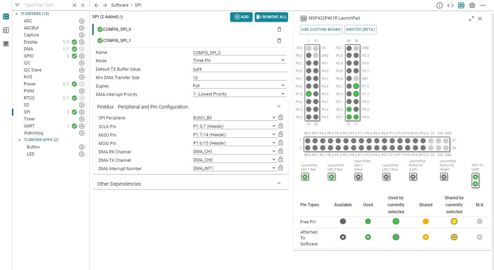
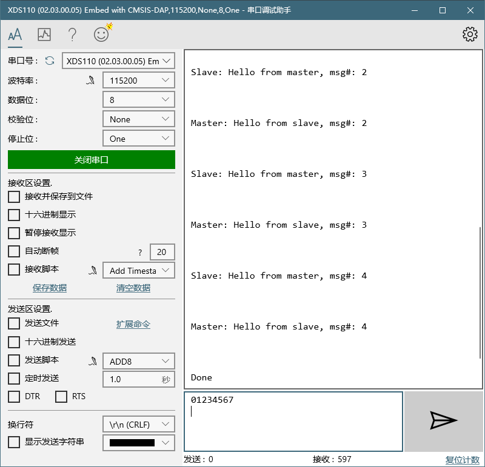

# SPI的使用

## 说明

从本章开始，我们正式开始了MSP432的中级应用。在之前的介绍中，我记述的内容是基本可以应用上我们这块开发板的全部资源。当然也有少部分板载资源我还没介绍到，例如ADC功能或低功耗计数，这类知识我将放在后面讲，因为它们属于MSP432或者说TI的芯片所拥有的比较高级的功能（TI的芯片在这些功能上相对于其它普通芯片有所加强）或者平常应用很少接触的功能。

## 介绍

言归正传，我们开始介绍TI-Drivers的SPI，关于SPI的知识可以参考百度百科：

https://baike.baidu.com/item/SPI/53075243

总结下来它是一种通信总线，而且应用非常广泛，平常我们使用的大部分芯片或模块，要使用它们，我们通常有两种通信途径（并非只有两种，而是绝大部分是这两种），即I2C和SPI，而其中SPI的速度又远高于I2C，非常适合高速设备的使用。不过不用害怕，作为一种通信总线，SPI的使用方法和UART非常类似。

## 例程

打开spiloopback例程，这个例程可以让我们在单机的状态下实现SPI的回环检测（就自己跟自己通信）。

看主程序：

```c
/*
 *  ======== spiloopback.c ========
 */
#include <string.h>
#include <stdint.h>
#include <stddef.h>

/* POSIX Header files */
#include <pthread.h>
#include <unistd.h>

/* Driver Header files */
#include <ti/drivers/GPIO.h>
#include <ti/drivers/SPI.h>
#include <ti/display/Display.h>

/* Driver configuration */
#include "ti_drivers_config.h"

#define SPI_MSG_LENGTH  50

#define THREADSTACKSIZE 1024

#define MAX_LOOP 5

#define MASTER_MSG  "Hello from master, msg#: "
#define SLAVE_MSG   "Hello from slave, msg#: "

static pthread_barrier_t barrier;
static Display_Handle display;

unsigned char masterRxBuffer[SPI_MSG_LENGTH];
unsigned char masterTxBuffer[SPI_MSG_LENGTH];

unsigned char slaveRxBuffer[SPI_MSG_LENGTH];
unsigned char slaveTxBuffer[SPI_MSG_LENGTH];

/*  ======== slaveThread ========
 *  This thread runs on a higher priority, since slave
 *  has to be ready for master. Slave SPI sends a
 *  message to master and also receives message from
 *  master.
 */
void *slaveThread(void *arg0)
{
    SPI_Handle slaveSpi;
    SPI_Params slaveSpiParams;
    SPI_Transaction slaveTransaction;
    int i;
    bool transferOK;

    /* Initialize SPI handle with slave mode */
    SPI_Params_init(&slaveSpiParams);
    slaveSpiParams.frameFormat = SPI_POL0_PHA1;
    slaveSpiParams.mode = SPI_SLAVE;

    slaveSpi = SPI_open(CONFIG_SPI_1, &slaveSpiParams);
    if (slaveSpi == NULL) {
        Display_printf(display, 0, 0, "Error initializing slave SPI\n");
        while (1);
    }
    else {
        Display_printf(display, 0, 0, "Slave SPI initialized\n");
    }

    /* Wait for master to open spi */
    pthread_barrier_wait(&barrier);

    strncpy((char *)slaveTxBuffer, SLAVE_MSG, SPI_MSG_LENGTH);

    for (i = 0; i < MAX_LOOP; i++) {
        /* Initialize slave SPI transaction structure */
        slaveTxBuffer[sizeof(SLAVE_MSG) - 1] = (i % 10) + '0';
        slaveTransaction.count = SPI_MSG_LENGTH;
        slaveTransaction.txBuf = (void *)slaveTxBuffer;
        slaveTransaction.rxBuf = (void *)slaveRxBuffer;

        /* Initiate SPI transfer */
        transferOK = SPI_transfer(slaveSpi, &slaveTransaction);

        if (transferOK) {
            /* Print contents of slave receive buffer */
            Display_printf(display, 0, 0, "Slave: %s\n", slaveRxBuffer);
        }
        else {
            Display_printf(display, 0, 0, "Unsuccessful slave SPI transfer");
        }
    }

    /* Deinitialize SPI */
    SPI_close(slaveSpi);

    return (NULL);
}

/*
 *  ======== masterThread ========
 *  This thread runs at a lower priority after the slave
 *  task to ensure it is ready for a transaction.
 *  Master SPI sends a message to slave and also
 *  receives message from slave.
 */
void *masterThread(void *arg0)
{
    SPI_Handle masterSpi;
    SPI_Params masterSpiParams;
    SPI_Transaction masterTransaction;
    int i;
    bool transferOK;

    /* Initialize SPI handle as default master */
    SPI_Params_init(&masterSpiParams);
    masterSpiParams.frameFormat = SPI_POL0_PHA1;
    masterSpi = SPI_open(CONFIG_SPI_0, &masterSpiParams);
    if (masterSpi == NULL) {
        Display_printf(display, 0, 0, "Error initializing master SPI\n");
        while (1);
    }
    else {
        Display_printf(display, 0, 0, "Master SPI initialized\n");
    }

    pthread_barrier_wait(&barrier);

    strncpy((char *)masterTxBuffer, MASTER_MSG, SPI_MSG_LENGTH);

    for (i = 0; i < MAX_LOOP; i++) {
        /* Initialize master SPI transaction structure */
        masterTxBuffer[sizeof(MASTER_MSG) - 1] = (i % 10) + '0';
        masterTransaction.count = SPI_MSG_LENGTH;
        masterTransaction.txBuf = (void *)masterTxBuffer;
        masterTransaction.rxBuf = (void *)masterRxBuffer;

        /* Turn on user LED, indicating a SPI transfer is in progress */
        GPIO_write(CONFIG_GPIO_LED_1, CONFIG_GPIO_LED_ON);

        /* Initiate SPI transfer */
        transferOK = SPI_transfer(masterSpi, &masterTransaction);

        if (transferOK) {
            /* Print contents of master receive buffer */
            Display_printf(display, 0, 0, "Master: %s\n", masterRxBuffer);
        }
        else {
            Display_printf(display, 0, 0, "Unsuccessful master SPI transfer");
        }

        /* Sleep a short time to allow the LED to flash */
        usleep(500000);

        /* Turn off user LED, indicating the SPI transfer is done */
        GPIO_write(CONFIG_GPIO_LED_1, CONFIG_GPIO_LED_OFF);

        /* Sleep for a bit before starting the next SPI transfer  */
        sleep(3);
    }

    /* Deinitialize SPI */
    SPI_close(masterSpi);

    Display_printf(display, 0, 0, "Done\n");

    return (NULL);
}
/*
 *  ======== mainThread ========
 */
void *mainThread(void *arg0)
{
    pthread_t           thread0, thread1;
    pthread_attr_t      attrs;
    struct sched_param  priParam;
    int                 retc;
    int                 detachState;

    /* Call driver init functions. */
    Display_init();
    GPIO_init();
    SPI_init();

    /* Configure the LED pins */
    GPIO_setConfig(CONFIG_GPIO_LED_0, GPIO_CFG_OUT_STD | GPIO_CFG_OUT_LOW);
    GPIO_setConfig(CONFIG_GPIO_LED_1, GPIO_CFG_OUT_STD | GPIO_CFG_OUT_LOW);

    /*
     *  Create a barrier to allow the master task to open its SPI
     *  handle before the slave task issues a SPI transfer.  Since the
     *  pin muxing is done in the call to SPI_open(), we need to make
     *  sure all pins are configured before the first transfer.  This
     *  will prevent the possibility of erroneous data being transfered.
     */
    pthread_barrier_init(&barrier, NULL, 2);

    /* Open the display for output */
    display = Display_open(Display_Type_UART, NULL);
    if (display == NULL) {
        /* Failed to open display driver */
        while (1);
    }

    /* Turn on user LED */
    GPIO_write(CONFIG_GPIO_LED_0, CONFIG_GPIO_LED_ON);

    Display_printf(display, 0, 0, "Starting the SPI loop-back example\n");

    Display_printf(display, 0, 0, "This example requires external wires to be "
        "connected to the header pins. Please see the Board.html for details.\n");

    /* Create application threads */
    pthread_attr_init(&attrs);

    detachState = PTHREAD_CREATE_DETACHED;
    /* Set priority and stack size attributes */
    retc = pthread_attr_setdetachstate(&attrs, detachState);
    if (retc != 0) {
        /* pthread_attr_setdetachstate() failed */
        while (1);
    }

    retc |= pthread_attr_setstacksize(&attrs, THREADSTACKSIZE);
    if (retc != 0) {
        /* pthread_attr_setstacksize() failed */
        while (1);
    }

    /* Create master thread */
    priParam.sched_priority = 1;
    pthread_attr_setschedparam(&attrs, &priParam);

    retc = pthread_create(&thread0, &attrs, masterThread, NULL);
    if (retc != 0) {
        /* pthread_create() failed */
        while (1);
    }

    priParam.sched_priority = 2;
    pthread_attr_setschedparam(&attrs, &priParam);

    /* Create slave thread */
    retc = pthread_create(&thread1, &attrs, slaveThread, (void* )0);
    if (retc != 0) {
        /* pthread_create() failed */
        while (1);
    }

    return (NULL);
}
```

## 使用

下述用法是基于手册的用法，我先介绍了然后用于分析示例程序，

1.  SPI_init()驱动初始化
2.  SPI_Params_init()初始化参数
3.  修改参数：
    1.  transferMode：发送模式：回调或阻塞
    2.  transferTimeout：等待时间：默认永久等待
    3.  transferCallbackFxn：回调函数
    4.  mode：主从选择
    5.  bitRate：比特率
    6.  dataSize：数据大小
    7.  frameFormat：CPOL和CPHA的模式
4.  SPI_open()打开SPI
5.  SPI_transfer()SPI收发数据，始终执行全双工
6.  SPI_close()取消SPI初始化示例（针对的open）

## 分析

拥有了上面的使用方法，我们大概就拥有了使用SPI的能力了，一般而言如果是主机的话是不需要设置回调的，个人认为中断回调这种用法比较适合SPI从机。另外在设置比特率的时候需要注意设备能够承受的最高频率，对于SMP432P4系列来说，从机最大为16MHz，主机位24MHz。另外SPI还需要保证传输双方的CPOL和CPHA是相同的，否则通信会异常。

然后我们现在来看看示例程序。

首先是SPI和GPIO的init，这个都可以看懂。

然后是pthread_barrier_init(&barrier, NULL, 2)，这个东西是TI-RTOS的东西，我也不是很清楚具体作用，手册里面只是笼统地说是barrier是一种将线程同步的东西，结合注释我猜测可以通过这个barrier用来防止某个SPI已经开始发送了，而另一个SPI还没设置完成。关于RTOS的部分我将会在后面研究完成后单开几章讲。为了方便，下面所有带pthread的部分我们都先跳过，它们的总体目的就是为了开启两个新的线程用于运行两个SPI。

除此之外，在mainThread还剩下的内容就是一堆交互，不用管。

现在，我们要开始分析两个SPI线程了。

### 主机

首先看到masterThread。

因为SPI_init已经用过了，所以可以不再init一遍，无论任何外设或库的init，本质上都只需要init一遍就行。

所以进这个程序后的第一步是Params_init，接下来是细调参数后使用SPI_open。接下来我们就可以看到一个pthread_barrier_wait函数，虽然刚才说不讲，但是还是提一下，通过名字我们可以知道这个东西的作用现在是等待（阻塞），那么我们不难想象它的工作机理，其实应该就是等待所有的barrier都进入到这个阻塞中后，我们就一下子把它们同时启动，这样就实现了线程的同步了。而我们进入这个等待的目的是因为SPI并没有所谓的重传机制，那么如果没有这个同步，那么发送方的信息可能已经发出，而接收方因为没有完成初始化就可能没能接收到，那么接收方就永远失去了这条信息。当然，要这样同步的主要原因是我们用的回环测试，如果和外部进行通信，那么会有不同的同步方式，有些是检测电平变化，有些是规定了延时时长，这些需要具体情况具体分析。

接下来，使用了strncpy这个函数，该函数来自于标准库string.h中，作用是字符串复制，对于我们在SPI的使用不是很重要。

接下来是一个比较重要的点了，在收发之前，程序中配置了一个结构体masterTransaction，它的类型是SPI_Transaction。其中配置了count、txBuf和rxBuf。其中count是指的SPI信息帧数，大概意思应该是每次发送的数据长度。而txBuf和rxBuf是两个void类型指针，这也是一个C语言的有意思用法，通过这个指针，我们可以不需强制类型转换而去访问任何数据类型的地址（它的用法最好自行百度一下）。

这个结构体的整体内容为：

-   count：通信帧数
-   txBuf：发送缓存
-   rxBuf：接收缓存
-   arg：回调参数
-   status：SPI的状态，这个是SPI驱动处理的状态码，我们一般只读它就好
-   nextPtr：驱动程序内部字段，不应由程序访问

接下来使用SPI_transfer通信，通信结果将会返回到一个transferOK的变量中，成功为true，失败为false，通过这个结果程序会返回相应的数据进行响应。发送将会执行多次，然后结束后通过SPI_close关闭SPI。

### 从机

有了主机的经验，我们可以来看看从机了，不过其实也没啥看的了，因为从机的配置其实和主机几乎一样，唯一的区别在于Slave的模式是SPI_SLAVE。

### 连线

现在我们需要把主机的接口和从机的接口接好，你仍然可以通过ti_config_drivers去查看，不过这一次我想用syscfg文件直接查看，这样更加显眼。也更加方便。我们打开syscfg文件，然后选择SPI打开，接下来我们即可以进行查看SPI连线了。和UART不一样，SPI的连线是同名相连即可，具体引脚含义请参考百度百科。



### 结果

我连好线了，注意在连线之前一定要确定接线安全，最好先把程序烧录上去再上线，否则一些引脚设为输入，另一些设为了输出，而此时两者相连，就很可能短路以至于烧坏板子。现在我们运行一下，同时依靠串口调试助手测试一下结果。



## 补充

我们在本次实验中并没有设置CS片选脚，该引脚一般来说只需要在使用多个引脚的时候使用，并且它属于一种主动控制引脚，并非属于SPI外设来控制，一般而言它是GPIO来负责的。之所以要使用片选，是因为SPI总线在进行发送的时候是针对整个总线网络发送的，在此期间从机其实并不能理解自己是否是本次通信的主体，而如果发送的一些信息格式相同，就很可能导致从机出现错误响应。那么最简单的方法其实就是使用一个片选引脚来进行通知，一般片选引脚的使用方法都是主机主动将该引脚拉低，然后从机接收到这个下拉的信号就会进入通信的状态。

另外因为SPI收发是全双工，我们在通信的时候无论是接收缓存还是发送缓存，在每次通信时都会参与，这点需要注意。

