# CCS的安装和使用

[TOC]

## 软件安装

MSP432在官方给出的常用编程方案有四种：IAR、KEIL、GCC和CCS。其中GCC和CCS是免费的，不过GCC的配置方法以及使用方法更加复杂，如无特殊需求这里就建议使用CCS，它是TI官方推出的一款IDE。

关于CCS的下载安装网上资料很多，这里就不作详述了，可以参考这篇博客：https://blog.csdn.net/qq_36788698/article/details/82913956，不必完全按照他的步骤来，根据自己需求进行酌情修改，比如我的电脑空间够大，在选择需要安装的设备时，我就直接选择的全部安装。

安装完成后，选择工作目录，最好选择放在一个大一点的硬盘的文件夹中。我放置的目录为：`D:\Code\MCU\TI`。

## CCS界面

安装完成后可以点击View，选择Resource Explorer进入资源浏览界面，这里有比较丰富的示例代码、SDK包等内容。

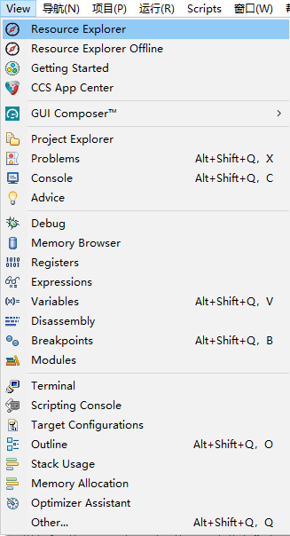

关于我的CCS工作栏是中文的，是因为我安装了eclipse的中文插件，如有希望修改的朋友可以参考这篇文章的汉化部分（这是针对cubeide的安装教程，但因为cubeide和ccs都是基于eclipse设计的，而这个汉化包也仅针对eclipse的内容，故都可以使用）：https://wenku.baidu.com/view/3174bc36996648d7c1c708a1284ac850ad0204a6.html，不过需要注意的是，他给出的汉化包地址为`http://mirrors.ustc.edu.cn/eclipse/technology/babel/update-site/R0.17.0/2019-06/`，从URL不难看出这是2019的版本了，虽然只是汉化eclipse的部分可能无所谓，但是为了保险起见请将后面的版本部分删除，然后用浏览器去访问地址：`http://mirrors.ustc.edu.cn/eclipse/technology/babel/update-site/`，在我写下这个笔记的时候，可以得到如下界面：

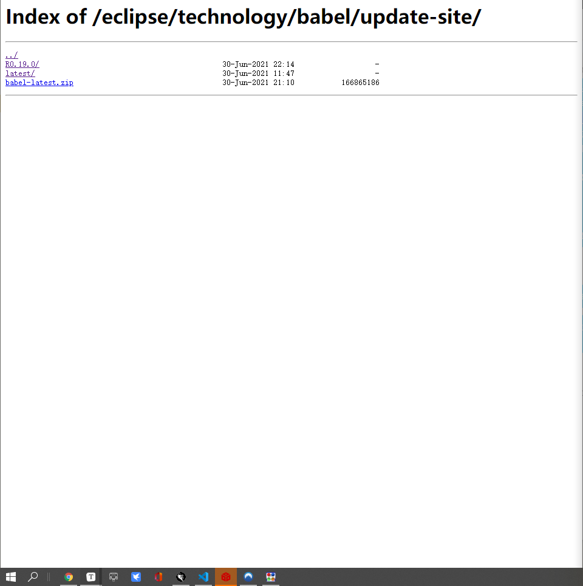

根据之前那个教程里面的地址的命名思路，我们可以点击`R0.19.0/`进入下一个路径：

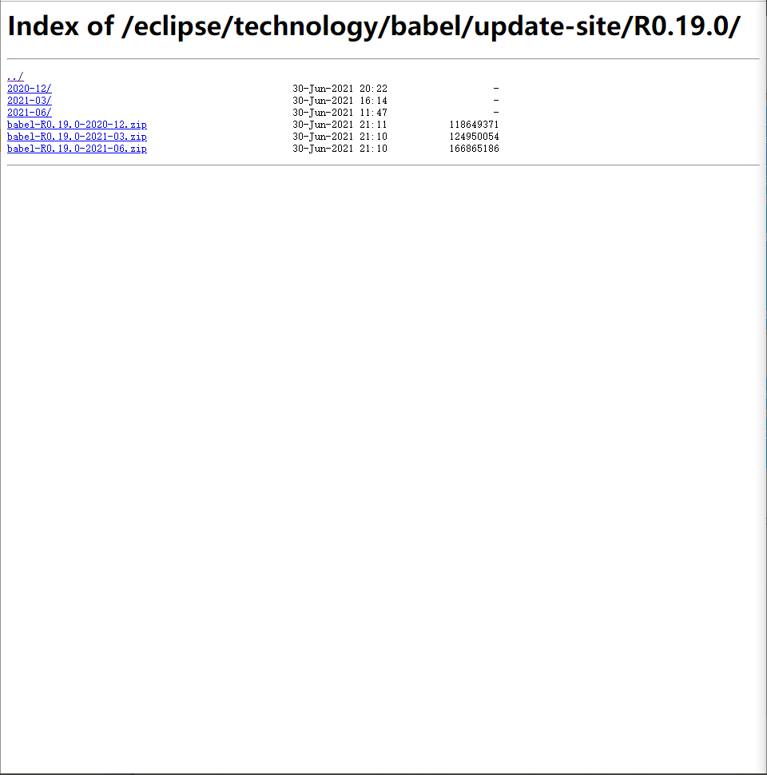

这里会有三个路径和教程中的类似，这里我们选择`2021-03/`，理由是六月的那个太新了，可能还会有bug，而剩下的两个较稳定版本中我们选择较新的那一版。

点进去后把路径复制一下即可：`http://mirrors.ustc.edu.cn/eclipse/technology/babel/update-site/R0.19.0/2021-03/`

## 资源浏览器

然后我们继续前面的说Resource Explorer，根据目前我的观察分析认为，它是TI在CCS中安装的一个基于chromium的小型浏览器（具体是不是这个内核我不确定，但是TI对此的描述大概是这个浏览器可以运行的内容都可以在Chrome上查看）。进去的界面大概是这样的，不过随着版本的更新可能也说不准，另外我这个样子其实已经是使用过一阵子的样子了，但总体差不多就行。

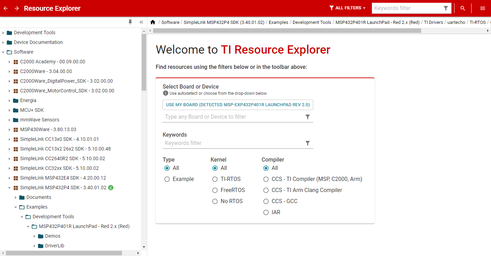

然后可以在Welcome那个界面的`Type any Board or Device to filter`中输入你的芯片名，我用的官方的MSP432P401R，则可以在输入后选择这个Board，如果是自己做的板子而且设计方案和TI有很大区别的话，最好选择下面那个芯片。

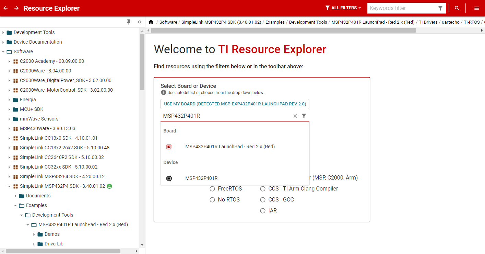

此时你可以在右边的那个文件列表中选择`Software->SimpleLink MSP432P4 SDK`，然后在右上角点击Install，我已经安装了故显示的是uninstall。它可能会让你选择一个安装地址，这个根据你自己的爱好随便选一个你找得到的地方即可。

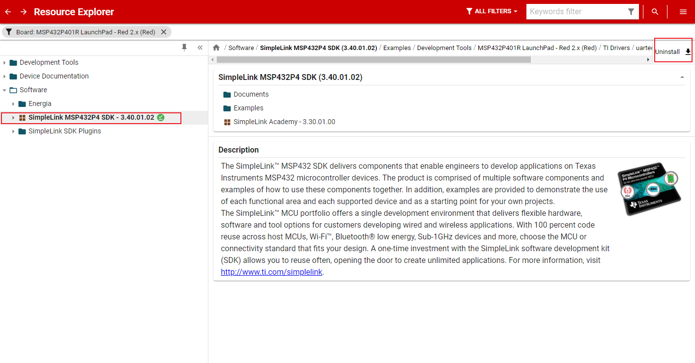

然后，你可以去你的安装目录看看。我的CCS安装目录是：`D:/Software/Work/CCS`，我直接把SDK安装在根目录的，现在这个根目录的样子如下所示。

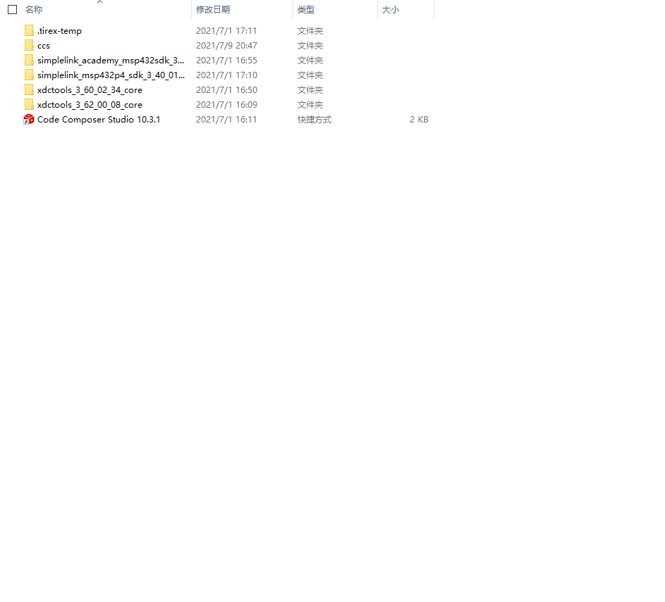

每个人的文件夹可能不一样，但是至少要有这两个文件夹：

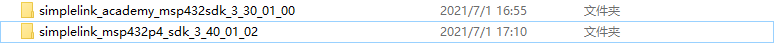

其中上面那个文件夹是TI的一个培训包，下面这个是sdk包。如果你觉得我这个教程看不懂了或者觉得有问题可以参考他的培训包内容，也可以直接打开sdk包直接查看源码。

## 培训包

其中培训包打开后是如下的样子：

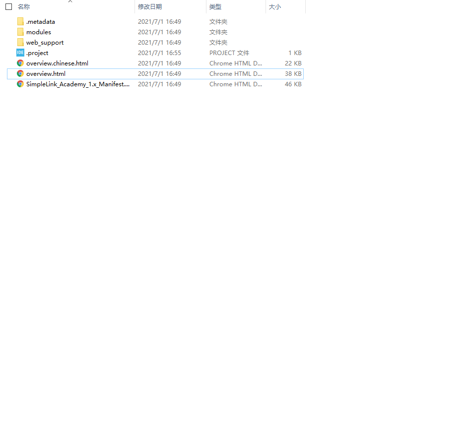

我们打开overview.html即可查看其培训内容，不过说实话里面的东西很少，更加需要多查看的是sdk包。

## SDK包

打开SDK包后我们可以看到如下的目录，我将简要介绍每个文件的作用。

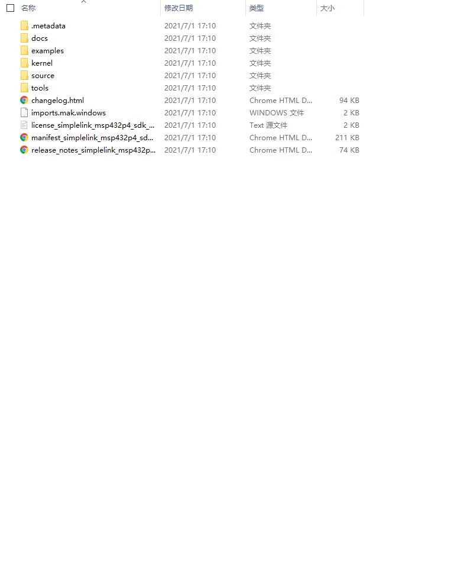

其中`.metadata`文件夹和最下面的`changelog.html`、`imports.mak.windows`、`license_simplelink_msp432p4_sdk_3_40_01_02.txt`、`manifest_simplelink_msp432p4_sdk_3_40_01_02.html`、`release_notes_simplelink_msp432p4_sdk_3_40_01_02.html`几个文件夹都不用管，他们没啥用，除此外其它几个文件夹都很重要。

### docs

这个文件夹是存储的各种文档，当你没法上网或者网络环境不好去TI官网找最新资料的时候，可以在这个文件夹来看。

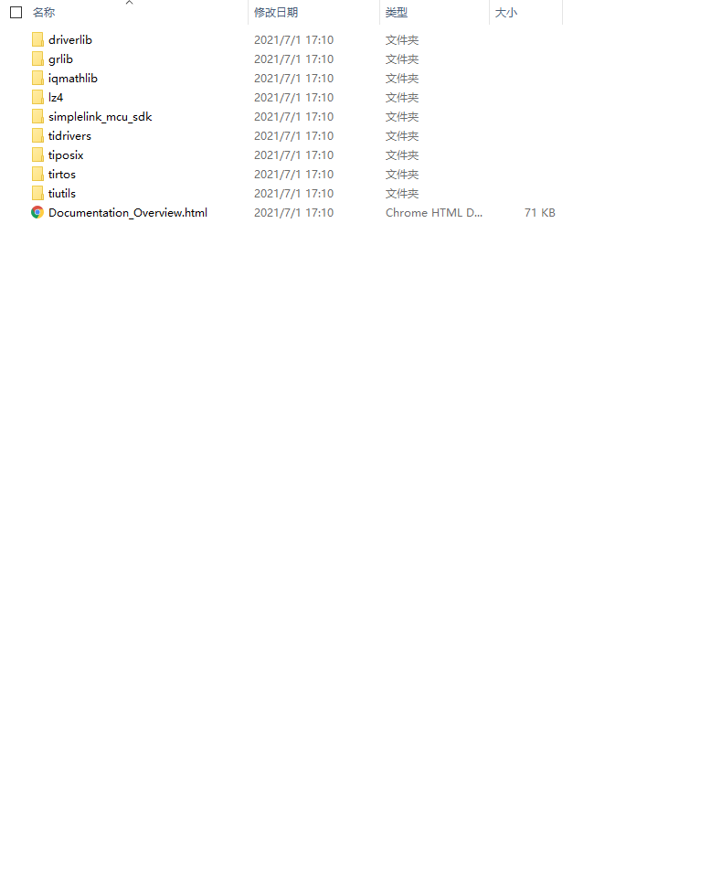

一般来说建议直接打开`Documentation_Overview.html`这个网页，这相当于一个向导目录。

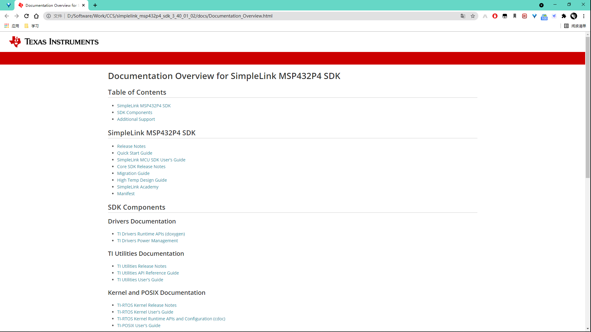

这是打开后的样子，如果用Chrome或新版Edge打开可以直接网页翻译。

在初期学习阶段，这两块比较重要，这也是后面笔记的主要参考材料之一：

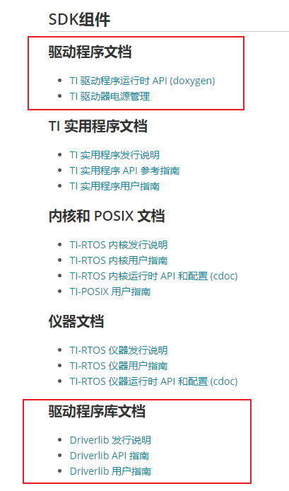

### examples

这个文件夹内部装的是TI的示例程序，一般来说不用主动去看，它主要作用为在没有网络或网络环境不好的时候通过离线版本的资源浏览器去加载示例或框架。

### kernel

内核程序，这里面涉及的东西都比较底层的控制，它们是我们编程的时候的驱动库。

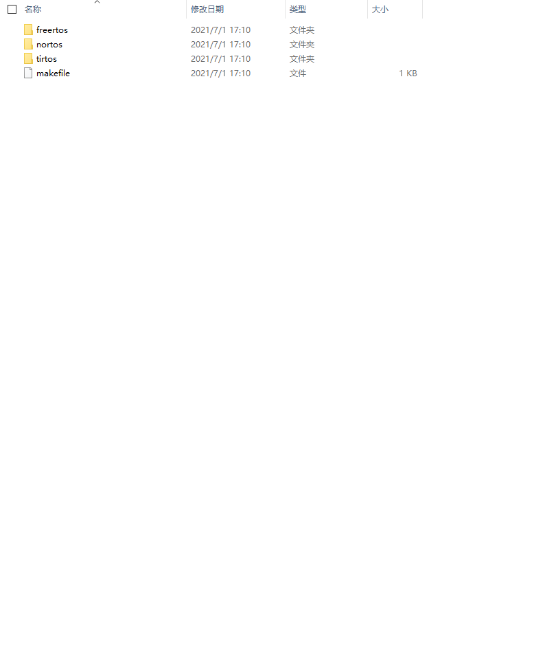

### source

资源程序，和kernel一样是作为驱动库存在，但在编程中它处于更加更高的层面封装。

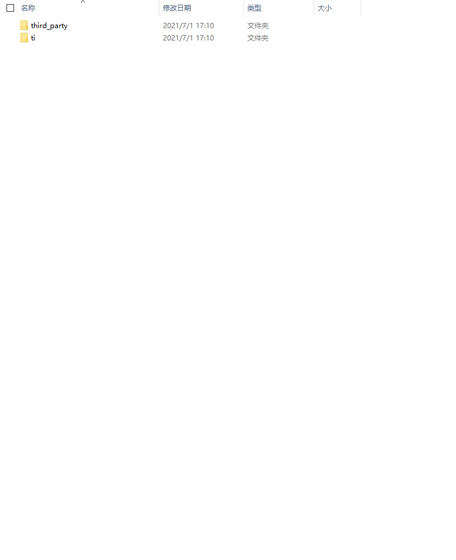

### tool

工具，这个文件夹下面有一些比较方便的工具可以使用，另外好像TI提供了一个工具可以快捷的制作上位机，不过具体这块我也没研究，如果感兴趣可以在培训包里面看到相应介绍。

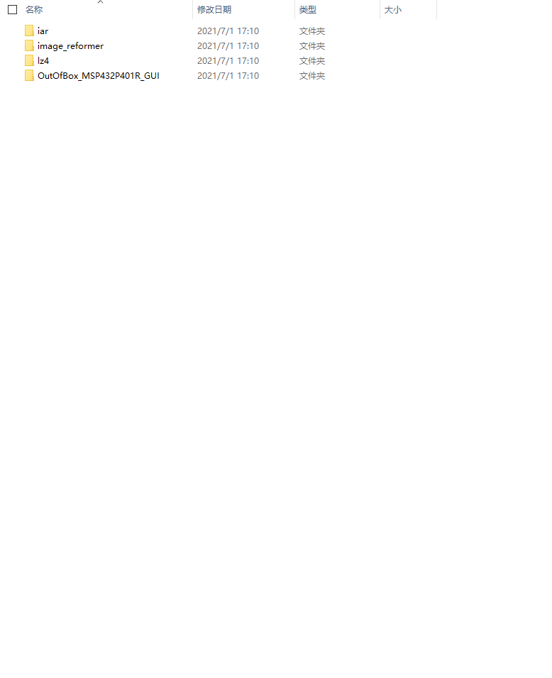

## 总结

在本次笔记中我们完成了CCS的安装以及一些基本的配置，并下载了SDK包，需要注意的是如果你需要在IAR或者CCS中对MSP432进行编程，同样也需要下载SDK，以作为其驱动程序，它也可以直接在官网下载到。