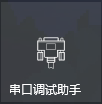
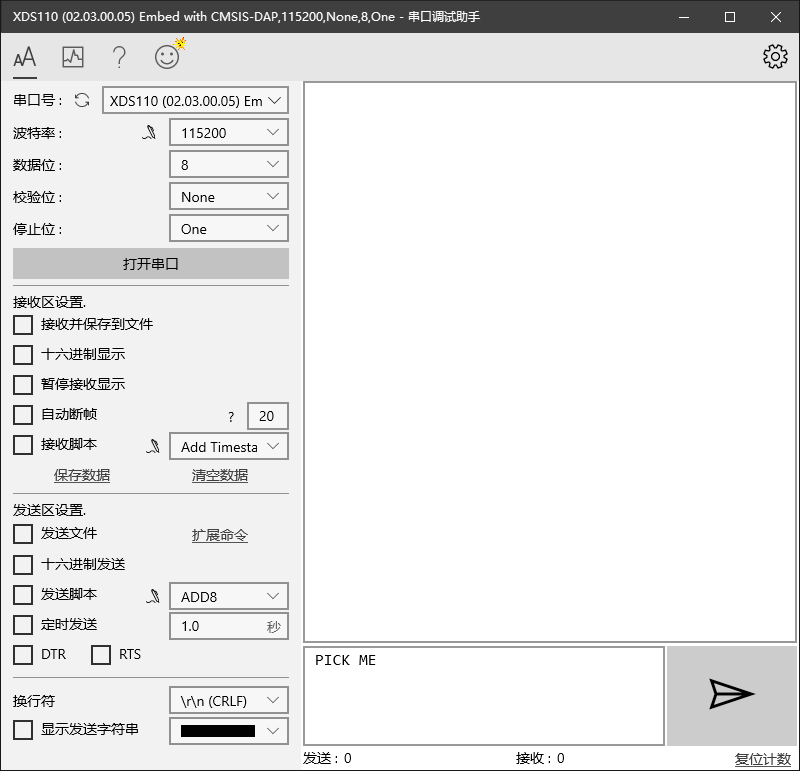
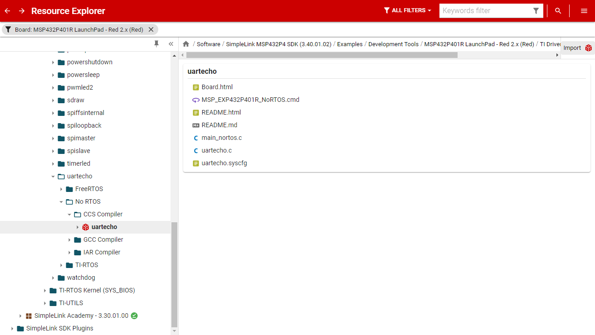
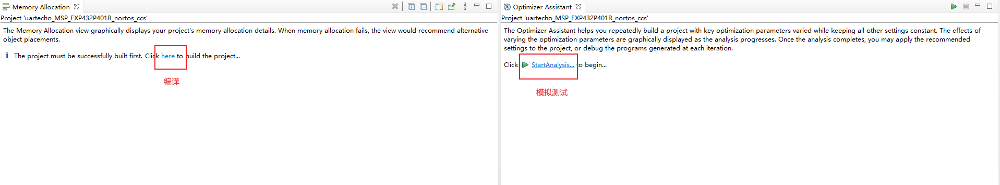
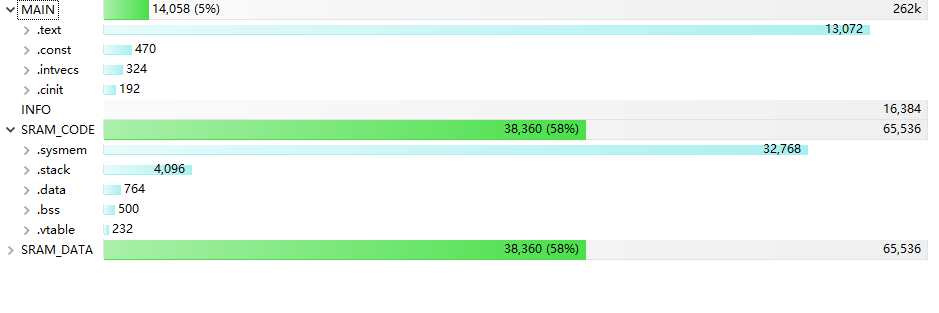
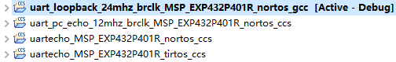
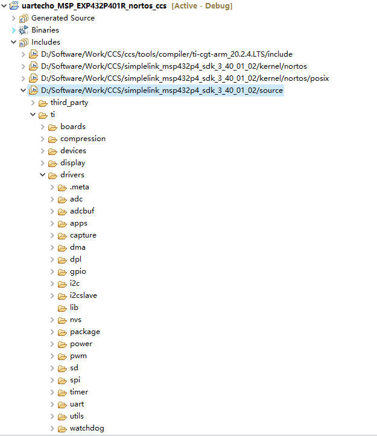
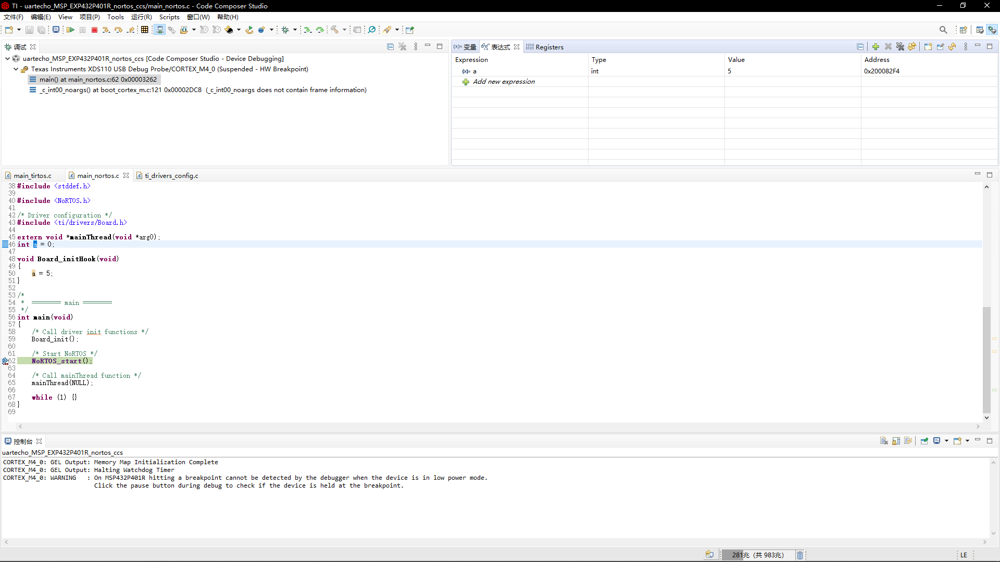
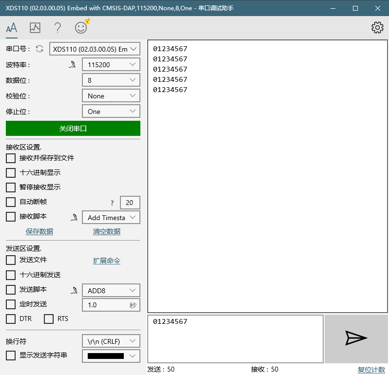

# UART的使用

[TOC]

## 介绍

UART，一般来说大家习惯称其为串口，不过这种说法不是特别准确，因为串口的意思应该是串行接口，而UART正经一点的翻译应该为异步收发传输器，其中异步表示连接设备不需要共同时钟进行同步，收发传输器则表示其本身功能为收发信息，之所以叫串口主要是因为它的数据发送方式是串行发送的，不过这都不重要，因为你非要在和别人讨论的时候把串口故意讲成异步收发传输器，别人反而可能听不懂或者觉得你很烦，名称为交流而生，心里晓得这个名字和含义就行了。UART是在嵌入式中应用最广泛的通信接口之一，不过这里不具体讲其物理上的工作原理，感兴趣可以查看百度百科：

https://baike.baidu.com/item/UART/4429746?fr=aladdin

这个词条是经过科普中国审核的，基本可以放心看。

## 重点

我们不关注UART的实现原理，但如果需要使用它我们至少需要知道以下内容，这些内容对于任意芯片在UART方面的使用都是必须的，从另一个角度上来说，只要你掌握了一个芯片的以下内容，你就相当于拥有了使用该芯片UART的能力：

-   硬件
    -   UART的连线方法
-   软件
    -   UART的配置
    -   UART的发送
    -   UART的接收

当然这些东西仅仅只是能让我们可以使用UART，而如果需要使用更多更复杂的功能，则还需要更加深入地学习，不过本笔记的目的在于入门，仅关注上述使用基础部分。

## 硬件

### 连线

比较常用的UART一般是RS232接口的，可以查看百度百科进行了解：

https://baike.baidu.com/item/RS-232/2022036?fromtitle=rs232&fromid=3555506&fr=aladdin

请注意UART是一种通信协议，而RS232则是一种电气接口。但是对于现代我们常用的单片机来说，RS232需求电平太高，而对于短距离通信来说使用单片机自己的CMOS电平就够了，而一般单片机中通常也是这样做的，以引脚输出高电平为逻辑‘1’，而以低电平为逻辑‘0’，一般习惯用5V单片机的TTL电平来通指上述方案，不过从定义上来看3.3V单片机使用的串口不能算TTL电平，在5V系统和3.3V系统进行串口通信的时候需要注意电平的转换，这些都可以在网上搜到，这里就不详细讲了。

UART的连接方法是双方的Rx脚与对方的Tx脚连接，如果涉及了流控引脚的话会更加复杂一些，不过我们这里仅讲述两线UART接法，这是在工程中最常用的方法，如果对更加完整的接法感兴趣可以参考这篇文章：

https://www.cnblogs.com/923327iu/p/12159551.html

当然你也可以搜索其它相关知识，关键字为：串口、流控。

### 板载资源

不过我们在本次笔记中的使用方法其实是MSP432通过串口与CMSIS-DAP相连，然后CMSIS-DAP通过USB与电脑进行通信。这样做的目的是为了更好的观察到串口的交互。下图是我的板子，我们可以观察到这块板子中间有一段虚线把板子分成了上下两块，虚线上面那个板子的芯片型号为MSP432E401Y，而下面是我们真正使用的的板子型号MSP432P401R。之所以会有两块板子，是因为上面那个板子本质上是TI的仿真器XDS110，它是一块基于CMSIS-DAP项目和TI的MSP432E401Y芯片研发设计的一块仿真器，功能主要是提供基础的芯片程序仿真下载的功能，除此之外CMSIS-DAP还拥有USB转串口的功效。可以注意我在下方用蓝线框住的地方，其实就是仿真器和芯片连接的串口位置。如果把这两个跳线取开，单独使用下面MSP432P401R的引脚，也可以单独让MSP432P401R的串口引出以供连接其它设备使用。而之所以要把串口转成USB，主要是因为现代的电脑已经很少有装载了串口设备的了，电脑无法直接解析串口发过来的数据，故厂商提供了一种解决方案，就是使用虚拟串口，通过虚拟串口设备（即拥有USB转串口功能的设备），即可完成串口到USB的数据透传，进而被电脑中专门的串口软件解析并显示。


### 串口助手

网上搜串口助手其实就会有很多的串口助手可供下载，我这里推荐两个，一是Microsoft Store中的一个叫串口助手的软件，图标长这样：，另一个则是野火的多功能调试助手上位机，下载地址为：

http://doc.embedfire.com/products/link/zh/latest/deskapp/ebf_trace_tool.html

当然，你也可以使用Python、C#、QT去写你的上位机，这样可以得到一些更加个性化的功能。另外TI好像也弄了个什么上位机制作工具，我还没研究过，感兴趣可以自己研究一下。目前来说我们用串口助手就够用了。

## 软件

### 通用参数

一般而言UART会有一些通用的参数，这些参数在不同设备上都会有，且必须设置。

#### 串口号

既然我们需要配置UART，肯定需要知道哪些参数需要调整，此时你可以打开一个串口助手来作为参考。我们可以观察发现，左边第一行参数为串口号，它本质上其实是你的USB转串口工具在电脑中被分配的虚拟COM编号，这个编号可以在Windows的设备管理器中看到。不过我们这个串口调试助手的设计方式不一样，它显示了设备的名称，故不需要专门去查看COM也可以。这个串口号不是我们需要专门去设置的参数，而是Windows在使用中给我们自动分配的，我们不需要太在意。

#### 波特率

然后下面的四个参数就比较重要了，尤其是波特率，一般来说常用的波特率有9600、19200、115200等，这个可以点击波特率那个下拉框就可以看到。波特率其实就是指的信息传输速率，波特率越高信号传输速度越快，但同样的对硬件抗干扰性的要求也就越高。交互双方的波特率必须设置相同，否则容易出现乱码出错等问题，如果你确定双方的波特率相同但还是出现了传输错误，则可以降低波特率试试。



#### 数据位

数据位指的单次发送一次串口数据包中属于真实数据的位（即我们需要用于透传的数据，在发送UART数据的时候不止会发送透传数据，还有一些用于起始停止校验的数据位），正常情况下一般就是8，而如果遇到一些比较古老的设备，则可能需要设置为5\~7。

#### 校验位

校验位用于奇偶校验，想了解的可以百度，总之是一种防止数据出错的方式，一般而言可以设置为None就行，否则需要选择奇校验或偶校验。

#### 停止位

用于表示发送结束的位，通常设为1即可。

### 例程讲解

#### 打开例程

想要了解MSP432P401R-UART的特殊之处，除了去查看手册外最简单的方式还是直接打开例程。关于UART的例程挺多的，我们现在打开几个主要例程（即主要针对UART的例程）。打开方法为在Resource Explorer中选择MSP432P系列的SDK，然后选择Examples，在其中寻找和UART有关的例程，并在进入后选择Import。以下是一个在`Examples/Development Tools/MSP432P401R LaunchPad - Red 2.x(Red)/TI Drivers/uartecho/No RTOS/CCS Compiler`的例程，在点进去后选择右上角的Import即可导入到工作空间中。



点击后可能会出现以下的弹框：



其中左边可以点击here进行一次编译，这个可以而且建议先点，编译后会显示一些最终代码在Flash中的存储信息。



比如这里就讲了MAIN在text、const、intvecs、cinit中占有的长度，以及SRAM中各代码区段的占用量等。当然，这个对于初学来说不是很重要，但在后期写大量代码的时候可以作为一个代码结构优化参考。

而在弹框的右边可以点击StartAnalysis进行模拟测试，它会给出不同优化等级下（编译器对代码的自动优化）不同的代码结构信息以及最终优化编译出的代码。这个可以点，但是不是很建议，最好在最终编程结束后再进行优化。

我们可以把它们最小化，然后进入工程。

用相同的方式，我一共打开了四个工程。包括`TI Drivers/uartecho`中的`No RTOS`和`TI-RTOS`的`CCS-Compiler`和`Driverlib`里关于uart的两个例程。



#### NoRTOS

##### 整体结构

我们从TI-Driver的两个例程开始讲起，这两个例程的功能都是一个echo回响程序，即外部设备通过串口向本机发送了任意数据，本机都会原样发送回去。例如在运行了本程序的单片机中，外部通过串口向其发送了“Hello World!\r\n”的数据，那么单片机也会向外部发送者返回一个“Hello World!\r\n”。

这两个程序中No RTOS没有使用RTOS（实时操作系统），而TI RTOS则使用了一个叫TI-RTOS的操作系统，这个系统是TI官方开发的，起始还有另一个FreeRTOS，那个是开源社区中开发的，不过TI官方开发的操作系统可能会更加适合于TI的芯片，故使用TI-RTOS，不过它们在使用上基本上是大同小异的，我们将在未来的RTOS笔记中详述。

现在，我们首先看No RTOS这个程序，因为我们只关注核心部分，前面的版权声明就不写了。

```c
/*
 *  ======== main_nortos.c ========
 */
#include <stdint.h>
#include <stddef.h>

#include <NoRTOS.h>

/* Driver configuration */
#include <ti/drivers/Board.h>

extern void *mainThread(void *arg0);

/*
 *  ======== main ========
 */
int main(void)
{
    /* Call driver init functions */
    Board_init();

    /* Start NoRTOS */
    NoRTOS_start();

    /* Call mainThread function */
    mainThread(NULL);

    while (1) {}
}
```

我们可以看到这是一个比较标准的C程序写法，在最前面是库引用，然后是函数声明以及下面的main函数。

因为参数或声明这些在没有使用前是无所谓其意义的，所以我们还是首先看它的主程序，即main函数部分。首先第一句是Board_init()函数，听名字应该是对开发板的初始化，我们使用`Ctrl+鼠标右键`可以进入此函数的定义，可以看到如下内容：

```c
/*
 *  ======== Board_init ========
 *  Perform any initialization needed before using any board APIs
 */
void Board_init(void)
{
    /* ==== /ti/drivers/Power initialization ==== */
    Power_init();

    Board_initHook();
}
```

##### 封装思维

这个程序的位置在ti_drivers_config.c中，这个文件其实时syscfg文件在编译的时候自动生成出来的，而syscfg文件是TI Drivers这个库中用于方便配置初始化的一个文件，类似于STM32的cubeMX（不过说实话没有cubMX好用），我们通过这个文件进行配置的功能都将被CCS里面的脚本程序进行处理，然后生成两个叫ti_drivers_config的.c和.h文件。

其中的Power_init()函数我们可以继续点进去看（实际上它的注释也说明了位置），可以跳到一个Power.h文件，这个文件本质上是TI Drivers的库文件之一，这里注释中写了对这个函数的介绍：

```c
/*!
 *  @brief  Power initialization function
 *
 *  This function initializes Power Manager internal state.
 *
 *  @warning The application is responsible for ensuring this function is
 *  called prior to any other Power API. Additionally, this function must be
 *  be called prior to any other TI-Driver's APIs. This function is normally
 *  called prior to any operating system initialization.
 *
 *  @return #Power_SOK
 */
int_fast16_t Power_init(void);
```

大概的意思就是这个函数用于初始化电源管理器内部状态。一般来说直接用这个就可以了，不过我还希望看到它的内部结构，此时可以在目录中选择`Include`中source那个目录，打开ti文件夹下的drivers文件夹：



往下翻到power文件夹下的PowerMSP432.c，然后就可以看到Power_init的定义内容，东西很多，我们也不需要把它看懂或者记住，因为这就是TI Drivers，我们现在使用的Power_init()函数的定义是这样的，如果更换了另一个单片机，换了一个SDK，我仍然可以继续使用Power_init()这个函数API，但是它的底层定义会修改成另一个单片机的，比如MSP430之类的，这也是所谓提高可移植性的本质：

```c
int_fast16_t Power_init()
{
    HwiP_Params hwiParams;

    /* initialize the power manager state */
    if (!PowerMSP432_module.initialized) {

        /* first, if device is resuming from a shutdown state ... */
        if (RSTCTL->PCMRESET_STAT &
               (RSTCTL_PCMRESET_STAT_LPM35 | RSTCTL_PCMRESET_STAT_LPM45)) {

            /* if a shutdown resume hook has been configured, call it now ... */
            if (PowerMSP432_config.resumeShutdownHookFxn != NULL) {
                (*(PowerMSP432_config.resumeShutdownHookFxn))();
            }

            /* now, unlock I/Os and the Backup domain */
            PCM->CTL1 = PCM_CTL1_KEY_VAL;
        }

        /* set module state field 'initialized' to true */
        PowerMSP432_module.initialized = true;

        /* initialize PowerMSP432_module.enablePolicy */
        PowerMSP432_module.enablePolicy = PowerMSP432_config.enablePolicy;

        /* copy the Power policy function to module state */
        PowerMSP432_module.policyFxn = PowerMSP432_config.policyFxn;

        /* if performance level control is enabled, initialize it */
        if (PowerMSP432_config.enablePerf) {

            /* now initialize performance control */
            PowerMSP432_module.perfInitialized =
                initPerfControl(PowerMSP432_config.initialPerfLevel);

            /* if CS interrupts are to be caught, configure interrupt and ISR */
            if ((PowerMSP432_config.useExtendedPerf) &&
                (PowerMSP432_config.enableInterruptsCS)) {
                HwiP_Params_init(&hwiParams);
                hwiParams.priority = PowerMSP432_config.priorityInterruptsCS;
                HwiP_create(INT_CS, (HwiP_Fxn)PowerMSP432_config.isrCS,
                    &hwiParams);
            }
        }

        /* if there is a configured policy init function, call it now ... */
        if (PowerMSP432_config.policyInitFxn != NULL) {
            (*(PowerMSP432_config.policyInitFxn))();
        }

        /*
         * set FORCE_LPM_ENTRY to force LPM3+ transitions, overriding any
         * outstanding peripheral clock requests
         */
        MAP_PCM_enableRudeMode();

#if DeviceFamily_ID == DeviceFamily_ID_MSP432P401x
        /* explicitly enable SRAM retention (for CS) */
        SYSCTL->SRAM_BANKRET |= 0xfe;
#endif
    }

    return (Power_SOK);
}
```

好了，这种底层我们就只展示这一次，未来除非必要我将不再继续展示这种底层程序，因为没有什么必要，既然人家封装了这么个库，学会用库就好了。但是你需要知道怎么找到这些函数的定义，以便于在未来的某一天你需要知道更加底层功能的时候，可以找得到，到时候再自己理解即可。另外你可能想知道这个底层是怎么封装的，这个时候可以观察上面这第56行的函数`MAP_PCM_enableRudeMode`，它其实就是TI的MSP432的标准库函数，它有可能被封装在了MSP432的一块专门的Flash空间中。

关于这个标准库被封装在Flash中，其实是TI在它们的芯片中给我们送了一点Flash，不过那些Flash不是给我们装东西的，而是它们把几乎所有的标准库封装到了那个Flash中，如果未来我们需要使用那个函数，就只需要调用它的地址即可，而之所以说是有可能，是因为不同芯片的架构原因，可能有一些芯片的Flash中没有完全封装所有的标准库，这个时候这个函数将会和我们使用其它单片机一样，以指令的形式被烧录到用户自用的Flash中。而为了应对这种不同的情况，TI就想了各办法用一个rom.h的文件中。然后程序的写法就成了MAP开头的一堆函数，如果被封装到了Flash（或者也可以说是ROM中），则会调用一种以ROM开头的函数，否则就会单独调用库函数。

##### \_\_attribute\_\_((weak))

现在我们回到ti_drivers_config.c文件中，继续看Board_init()函数，可以发现在Power_init下面，还有另一个函数叫Board_initHook()，这个函数很有趣，因为你去访问它的定义，会跳到前面，有如下的一个函数定义：

```c
/*
 *  ======== Board_initHook ========
 *  Perform any board-specific initialization needed at startup.  This
 *  function is declared weak to allow applications to override it if needed.
 */
void __attribute__((weak)) Board_initHook(void)
{
}
```

乍看一下它是一个无参数无返回值的普通函数，但中间多了一个\_\_attribute\_\_((weak))的定义。这玩意其实是GNU C的一个很有意思的机制，即\_\_attribute\_\_机制。虽然这个东西它不是宏定义，但它的主要功能和宏定义类似，都是用于交给编译器处理的一些特殊功能。我们在平常Windows下编程或者在STM32下编程中，也经常会使用这个功能，只不过它们可能被typdef或者#define过。

一般来说\_\_attribute\_\_（）的括号中常见的参数有aligned、packed、at、section、weak等等。其中aligned可以把数据在存储器中对齐、packed可以对结构体struct或联合体union优化对齐，at可以把数据绝对定位在存储器的某个位置，section的功能比较多和复杂，大概就是对代码段的划分。而我们这里使用的weak，则是一个弱化定义，类似于一个占位函数，又可以被更加强的函数重定义，类似于其它语言重载的意思（但不是重载那种大家共用名字，而是相当于直接等效替换内部功能）。最常见的替换是对printf的重定向，可能写过其它单片机的程序的朋友写过这样的程序：

```c
#ifdef __GNUC__
#define PUTCHAR_PROTOTYPE int __io_putchar(int ch)
#else
#define PUTCHAR_PROTOTYPE int fputc(int ch, FILE *f)
#endif

PUTCHAR_PROTOTYPE
{
	HAL_UART_Transmit(&PRINT_UART_HANDLE, (uint8_t *)&ch, 1, 0xffff);
	return ch;
}
```

这里是使用STM32的HAL库对printf的重定向，使用了这个功能后，我们就可以使用printf函数向串口调试助手中打印数据了。而之所以可以完成这个功能，是因为printf是基于fputc或\_\_io\_putchar函数写的，功能在Windows标准中为在控制台上打印一行字符（加换行符可以打印多行，但本质上还是打印的一行），而fputc的功能我们也知道，就是在控制台上打印一个字符。很显然，我们如果把向控制台打印一个字符换成通过串口发送一个字符，那么printf就相当于从串口发送一行字符了（但是如果要实现换行的功能，则必须加上\r\n，甚至有些编译器下使用printf打印串口加\r\n是必须的）。那么我们要如何把这个功能重定向到串口发送而不是控制台显示呢，这个\_\_attribute\_\_((weak))，通过这个定义把\_\_io\_putchar或fputc弱化，然后我们重新定义一遍这个函数，那么编译器就会优先使用这个没有被弱化，也就是说更强的函数定义，而不会链接原本的弱定义了。

所以我们如何使用它呢？很简单，我们可以在main_nortos.c中重新定义一遍这个函数即可，比如我可以定义一个全局变量`int a = 0`，然后定义一个void Board_initHook(void)，在其中对a进行赋值，假设是`a = 5`，结束后我们看看a的值是否发生变化即可。然后我把程序改成了这样：

```c
/*
 *  ======== main_nortos.c ========
 */
#include <stdint.h>
#include <stddef.h>

#include <NoRTOS.h>

/* Driver configuration */
#include <ti/drivers/Board.h>

extern void *mainThread(void *arg0);
int a = 0;

void Board_initHook(void)
{
    a = 5;
}

/*
 *  ======== main ========
 */
int main(void)
{
    /* Call driver init functions */
    Board_init();

    /* Start NoRTOS */
    NoRTOS_start();

    /* Call mainThread function */
    mainThread(NULL);

    while (1) {}
}
```

然后我们打个断点测试一下，可以发现，a的值确实变成了5。



##### BSP

那么这个Board_initHook是做啥的呢？这要引入一个概念叫BSP（Board Support Package），即板级支持包，它的作用是对开发板硬件资源的支持程序，而这里Board_initHook就可以作为BSP中的初始化程序，完成syscfg文件中配置不到的初始化功能。比如说，在板子上装了一个三色LED，我希望在板子通电的瞬间根据我的EEPROM中的某一位显示不同的色彩效果，那么我就可以把这部分的程序写在里面。作为开发板级别的驱动程序中的初始化程序。

##### RTOS

RTOS是指的实时操作系统，一般系统分为实时操作系统和非实时操作系统，其中实时操作系统常见的有FreeRTOS、RT-Thread OS、TI-RTOS还有µnOS等。而非实时操作系统一般有Windows、Linux等。实时操作系统主要在于其实时性，即保证任务在规定时间内完成，如果没完成则很有可能系统崩溃或进入错误中断，而非实时操作系统任务如果没有在规定时间完成可能会给你各警告然后把那个任务关掉就行。实时操作系统主要应用于对时序要求高，对稳定性以及鲁棒性等要求比较高的场合，比较经典和大型的应用一般是军事导弹发射或航空航天这类应用中。不过Windows和Linux这些系统好像也可以通过某种方法弄成实时操作系统，当然我没试过也不清楚。

##### NoRTOS_Start()

这个函数一般只用于TI Drivers中不使用RTOS的时候，它属于NoRTOS.h这个文件。TI的意思是TI-Drivers中的一些驱动程序依赖于RTOS的时钟等，同时一些软件中断模块或是特殊的处理可能也会用到RTOS的内容，而为了在无RTOS的情况下也可以使用这些代码，则应该将其配置为NoRTOS。

除此之外NoRTOS.h中还提供了两个API，NoRTOS_getConfig和NoRTOS_setConfig，这两个API分别被应用于配置NoRTOS时内部的状态参数等。待配置的参数是通过一个结构体来配置的：

```c
/*!
 *  @brief  NoRTOS framework global configuration
 *
 *  The NoRTOS_Config structure contains a set of values utilized by the
 *  NoRTOS framework.
 *
 *  The NoRTOS_getConfig() API can be used to retrieve the current settings.
 *  When changing one or more of these settings, a NoRTOS_Config structure
 *  should first be populated with the current settings by calling
 *  NoRTOS_getConfig(), after which the particular setting(s) that needs to be
 *  changed should be set and given to the NoRTOS framework by calling
 *  NoRTOS_setConfig().
 */
typedef struct _NoRTOS_Config {
    /*! Function that is called when a TI Driver "suspends" its operation */
    void (*idleCallback)(void);

    /*! Period of the internal Clock module's periodic "tick" (microsecs) */
    uint32_t clockTickPeriod;

    /*! Hardware interrupt posted by software to achieve the Swi (Software
        interrupt) scheduling paradigm */
    int swiIntNum;
} NoRTOS_Config;
```

实际上就三个参数，第一个是当驱动程序挂起（一种RTOS的状态）时的回调函数，第二个时内部时钟滴答的周期（微秒），第三个是硬件中断中的软件中断（SWI）的调度范式（我也不知道这个是做啥的）。

不过建议在使用TI-Drivers的时候就开启RTOS，无论是FreeRTOS或是TI-RTOS都可以，因为NoRTOS这种使用方法不太常见，以我们不太高的编程实力，我担心会出现一些未知的bug。

接下来我们即可进入到mainThread中了。

##### mainThread

mainThread函数就是这个例程的主线程了，其中我们不管变量的定义，直接从函数运行开始。

```
/*
 *  ======== uartecho.c ========
 */
#include <stdint.h>
#include <stddef.h>

/* Driver Header files */
#include <ti/drivers/GPIO.h>
#include <ti/drivers/UART.h>

/* Driver configuration */
#include "ti_drivers_config.h"

/*
 *  ======== mainThread ========
 */
void *mainThread(void *arg0)
{
    char        input;
    const char  echoPrompt[] = "Echoing characters:\r\n";
    UART_Handle uart;
    UART_Params uartParams;

    /* Call driver init functions */
    GPIO_init();
    UART_init();

    /* Configure the LED pin */
    GPIO_setConfig(CONFIG_GPIO_LED_0, GPIO_CFG_OUT_STD | GPIO_CFG_OUT_LOW);

    /* Turn on user LED */
    GPIO_write(CONFIG_GPIO_LED_0, CONFIG_GPIO_LED_ON);

    /* Create a UART with data processing off. */
    UART_Params_init(&uartParams);
    uartParams.writeDataMode = UART_DATA_BINARY;
    uartParams.readDataMode = UART_DATA_BINARY;
    uartParams.readReturnMode = UART_RETURN_FULL;
    uartParams.readEcho = UART_ECHO_OFF;
    uartParams.baudRate = 115200;

    uart = UART_open(CONFIG_UART_0, &uartParams);

    if (uart == NULL) {
        /* UART_open() failed */
        while (1);
    }

    UART_write(uart, echoPrompt, sizeof(echoPrompt));

    /* Loop forever echoing */
    while (1) {
        UART_read(uart, &input, 1);
        UART_write(uart, &input, 1);
    }
}
```

##### GPIO_init()

GPIO是通用型输入输出的简称，通过它可以去控制引脚的电平高低。这个GPIO_init()是TI-Drivers用于初始化GPIO的函数，类似于前面的Power_init()。注意要使用这个函数必须在前面调用`#include <ti/drivers/UART.h>`。关于GPIO的更多内容这里不详述，在后面GPIO的章节再说。

##### UART_init()

初始化UART的函数，其它同上。

##### GPIO_setConfig和GPIO_write

这两个函数的功能是让板载那个红色LED常亮。具体实现原理我们在GPIO章节再说，当然你也可以从后面的UART配置函数中窥见一二。

##### UART_Params_init(&uartParams)

这个函数从名字看来大概功能是初始化参数，参数的类型是一个叫UART_Params的结构体。大胆猜测一下应该是配置波特率那些东西。我们可以直接点进去看一下，从注释上大概能够理解一二。

```c
/*!
 *  @brief  Function to initialize the UART_Params struct to its defaults
 *
 *  @param  params      An pointer to UART_Params structure for
 *                      initialization
 *
 *  Defaults values are:
 *      readMode = UART_MODE_BLOCKING;
 *      writeMode = UART_MODE_BLOCKING;
 *      readTimeout = UART_WAIT_FOREVER;
 *      writeTimeout = UART_WAIT_FOREVER;
 *      readCallback = NULL;
 *      writeCallback = NULL;
 *      readReturnMode = UART_RETURN_NEWLINE;
 *      readDataMode = UART_DATA_TEXT;
 *      writeDataMode = UART_DATA_TEXT;
 *      readEcho = UART_ECHO_ON;
 *      baudRate = 115200;
 *      dataLength = UART_LEN_8;
 *      stopBits = UART_STOP_ONE;
 *      parityType = UART_PAR_NONE;
 */
extern void UART_Params_init(UART_Params *params);
```

这个函数的功能说白了就是直接给UART_Params设置一个初始值，初始值就是注释中那些，如果你愿意受累的话其实也可以手动写。我这里大概解释一下这些参数和初始值的作用，下面的说法并不严谨和专业，仅作参考思路或翻译思路使用。

-   readMode/writeMode：读写模式，分成阻塞读写和回调读写，也就是阻塞和中断的区别，默认为阻塞。
-   readTimeout/writeTimeout：超时设置，默认为永久等待，也就是发不完不会开始运行后面的语句。
-   readCallback/writeCallback：回调函数，这里因为用的阻塞模式，所以没有回调。
-   readReturnMode：接收返回模式，分为缓冲满接收和检测换行接收，这里接收指结束阻塞或执行回调，默认为检测换行接收，即检测到换行符就执行接收。此模式收到readDataMode的影响，仅在UART_DATA_TEXT模式下执行。
-   readDataMode/write：接收返回模式，分为二进制模式和文本形式，其中文本形式即UART_DATA_TEXT模式，在此模式下接收会检测换行符。读取的时候会用\n替换\r，发送的时候会在\n前添加一个\r。
-   readEcho：读取回显，如果打开则会回显接收到的字符，不过仅为文本模式下可使用。
-   baudRate：波特率，默认115200，前面说过了
-   dataLength：数据位，默认8位，同上
-   stopBits：停止位，默认1位，同上
-   parityType：校验位，默认无校验，同上

##### UART_Open

这个是用于打开串口的，我们先关注其返回值，是一个UART_Handle的句柄结构体，它的存在同样类似于STM32的句柄，不过STM32的句柄是包含了更加多的东西且在整个程序周期内都是有用的，而这个句柄则是在打开串口后有用。虽然功能少了一些，但总体更加轻量灵活。

然后我们可以观察UART_Open函数了，其中第二个参数是我们刚才初始化过的结构体，当然，示例中还进行了一些小的修改，不过我们也不用在意，在本程序中我们把中间这段修改部分删除后仍然可以正常运行echo程序。

现在重点是前面这个`CONFFIG_UART_0`是个什么东西。说实话这真的是我对TI工程师脑回路感到最神奇的一点，这个参数它其实是一个数组下标。当然，在详述之前先说一下我怎么发现的这个。

我们打开驱动库中UART.h和UART.c文件，当然主要是.c文件，毕竟.h文件中只是简单说了一下这是个index。现在我们去看程序：

```c
/*
 *  ======== UART_open ========
 */
UART_Handle UART_open(uint_least8_t index, UART_Params *params)
{
    UART_Handle handle = NULL;

    if (isInitialized && (index < UART_count)) {
        /* If params are NULL use defaults */
        if (params == NULL) {
            params = (UART_Params *) &UART_defaultParams;
        }

        /* Get handle for this driver instance */
        handle = (UART_Handle)&(UART_config[index]);
        handle = handle->fxnTablePtr->openFxn(handle, params);
    }

    return (handle);
}
```

可以发现这个index在函数中出现的未知是一个叫UART_config的数组，其数据类型被强制转换成了UART_Handle，但是本质上它的类型是什么呢？很显然这个变量并不是在这个函数里面的，它来自于外面，具体在哪？点进去看看就会发现，居然在ti_drivers_config.c这个文件里面。它其实是一个我们在syscfg文件里面配置出来的东西。而这个index，其实就是我们的这个UART_Config类型被命名为UART_config的数组的下标。从某种意义上这种方法加深了代码之间的耦合度，但syscfg的存在又使这个高耦合程序变得方便了。

##### 剩下的程序

剩下的程序就比较简单了，显示检测一下UART初始化是否发生了错误，如果发生了错误则会死循环在一个空循环中，而如果成功了则会输出一句"Echoing characters:\r\n"，然后开始把接收到的程序重新发出去的回显程序。

#### TI-RTOS

我们已经能看懂NoRTOS的部分了，那么TI-RTOS其实已经没有什么好讲的了。这里和前面唯一的差别在于mainThread不再是一个普通的函数，而是一个运行在TI-RTOS的任务线程了，关于Ti-RTOS的更多内容我们放在后面讲，这里不详述了，如果感兴趣可以大概看一下。

#### 标准库程序

其实在学习完成了TI-Drivers后我发现其实基本上就没有什么必要用标准库了，毕竟很麻烦而且可移植性较差。不过我们需要知道TI-Drivers本质上仍然是脱胎于标准库的，所以并不是标准库没用了，而是我们一般用不到，但偶尔如果需要提高你的程序性能或者对时序要求比较高，则也可以使用标准库程序。我在这里只是大概讲述一下标准库在这里的设计思路。

其中echo-12mhz的程序中，先是关闭了看门狗，然后设置了P1.2和P1.3位UART模式，然后设置了DCO主时钟为12Mhz。再之后初始化了UART模块并使能了它，打开了接收中断之后再逐个打开串口中断和睡眠模式唤醒中断以及总中断，最后进入while后进入PM0睡眠模式，直到遇到串口中断后确认是不是接收中断，如果是接收中断就讲接收到的东西重新转发回去。

其实可以看见设计思路并没有什么太大的区别，都是初始化，然后开中断或者开阻塞线程等，只是API写着不同，运行的性能有所区别而已。而如果是配置其它的芯片的串口也基本上都是大同小异。

### 例程中没有的东西——串口中断

如果只是看例程，我们其实还不能最好最完美地用到所有功能，至少在目前为止我们尚未看到如何使用串口的中断。当然或许有经验的朋友已经对此大概有所了解了，因为我们之前在配置UART_Params的时候，中间出现了几个带Callback的参数。我们不难大胆猜测一下，或许这就是中断函数？

实际上官方并没有给出很多例程，在网上找这块的资料好像也很少，所以我也花了几个小时看手册外加测试才慢慢试出来。

首先我们需要知道中断是什么，一般而言中断我们讲的是硬件中断，它本质上其实就是在我们正常运行程序的时候外设或内核在发生寄存器或电路电平跳变时内核发起的一个暂停程序工作，转而去运行另一段代码的功能。这样讲可能有点难理解，但是如果学过数电的话可能对触发器有所了解，我们可以把中断源想象成一个触发器的输入，而触发器的输出连接着总线读写指针（当然这样说并不是很严谨，芯片设计不只是这么简单，但对于理解来说够用即可），我们可能因为溢出、外部电平跳变……等等原因，给了触发器输入的一个触发信号，导致了总线读写指针临时跳变到了另外一个代码段。不同外设对应的跳转代码段地址不同，这个是在芯片初始化阶段配置的，我们平常不用管。在跳转了代码段这段期间，系统只运行中断内部的程序，而之前我们的主程序会在中断程序结束后进行运行。

而回调函数是什么呢？可以参考知乎上的问答：

https://www.zhihu.com/question/19801131

我就不献丑了。总之中断回调函数会在我们的中断处理结束后运行，为了方便直接理解成中断程序也可以，只不过在这个程序前后会进行一些你不用太过在意的系统配置而已。

然后在配置uartParams的阶段，你需要把一个针对UART的中断函数的函数指针传递给它。如果不懂函数指针是什么请自行百度，当然你直接按照我的方法来仿写也不会错。以下是通过中断来配置一个回响echo函数的串口配置过程。

```c
uint8_t buf[10] = {0};	// 缓存
UART_Handle uart;	// UART句柄
UART_Params	uartParams;	// UART参数

UART_Params_init(&uartParams);
// 读写改成二进制数据模式，根据需求可以不改
uartParams.writeDataMode = UART_DATA_BINARY;
uartParams.readDataMode = UART_DATA_BINARY;
// 二进制数据模式下只能读满返回，这里是相当于缓存满了才会触发中断
uartParams.readReturnMode = UART_RETURN_FULL;
// 中断读取模式
uartParams.readMode = UART_MODE_CALLBACK;
// 分配了一个中断函数指针，函数名自取
uartParams.readCallback = &UART0_Read_ISR;
// 关闭回响模式
uartParams.readEcho = UART_ECHO_OFF;

uart = UART_open(UART_index, &uartParams);	// 开启UART
UART_read(uart, buf, 10);	// 开启UART中断
```

上面是一个初始化的过程。

下面是中断函数。

```c
void UART0_Read_ISR(UART_Handle handle, void* buf, size_t size)
{
    UART_write(handle, buf, size);
    UART_read(handle, buf, size);
}
```

不难看出在使用TI-Drivers配置串口中断不是很复杂，重点在于以下部分：

1.  修改参数的readMode为UART_MODE_CALLBACK
2.  修改参数的readCallback，为其分配一个函数指针
3.  编写上面这个函数指针的函数，书写规范为无返回，三个参数，参数一是句柄，参数二是读取的缓存，参数三是读取的长度
4.  通过UART_read函数为上面三个参数分配具体数据，同时以此开启中断

除此之外，完全可以把其当作一个阻塞的UART来使用。

另外需要注意，UART在每次读取后会关掉中断，所以需要在里面调用一次UART_read保持开启状态。

下面是我用串口调试助手得到的效果：



注意我每次发送的内容是“01234567\r\n”共10个字符，如果少于这个长度则需要多次发送才会显示，如果超出这个长度则会丢失数据。 

## 测试

现在有了这些知识，你基本上可以写出任何的串口程序了，不如写个简单的程序来试试吧。

以阻塞的方式封装一个printf函数以及一些宏命令，配合串口中断，运行出一个四则运算计算器程序。你可能会在运行浮点数运算时发现printf会报一些错误，根据编译器的提示尝试去解决它（当然如果没有错那就最好了）。
